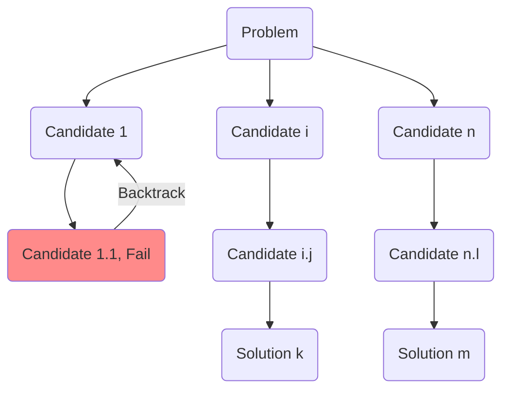

# Backtracking

[Backtracking](https://en.wikipedia.org/wiki/Backtracking) is a general algorithm for
finding all (or some) solutions to some computational problems, particularly constraint
satisfaction problems. It incrementally builds candidates for solutions and abandons a
candidate ("backtracks") as soon as it determines that the candidate cannot be extended
to a valid solution.

We can view the procedure of backtracking as a tree structure, where the root node
represents the initial problem and the leaves represent the solutions. Each node in the
tree represents a candidate solution, and the edges represent the choices made to reach
that candidate. **Backtracking** reduces the search space by eliminating candidates
(i.e. pruning the tree) that are not valid solutions.

The following diagram illustrates the backtracking process:



## How Backtracking Works

Backtracking is a depth-first search algorithm that explores all possible solutions to a
problem. It does this by building a solution incrementally, one piece at a time, and
discarding solutions that fail to satisfy the constraints of the problem as soon as they
are detected.
The algorithm can be summarized in the following steps:

1. **Choose**: Select a candidate solution.
2. **Check**: Check if the candidate solution is valid.
3. **Complete**: If the candidate solution is complete, return it.
4. **Backtrack**: If the candidate solution is not valid, backtrack to the previous step
   and try another candidate solution.
5. **Repeat**: Repeat the process until a solution is found or all candidates have been
   exhausted.
6. **Return**: If a solution is found, return it; otherwise, return failure.

## Code Template

The following code template summarizes some common patterns for the backtracking algorithm:

```python
def backtrack(candidate):
   # Base case
   if is_solution(candidate):
      output(candidate)
      return

   # iterate all possible candidates
   for candidate in candidates:
      if is_valid(candidate):
         place(candidate)  # Try the partial candidate solution.
         backtrack(candidate)  # Given the candidate, recursively explore further.
         remove(candidate)  # Remove the candidate (backtrack)
```

Here are a few notes on the code template:

- The numeration of candidates is done in two levels:
    - The first level is the **recursion**. At each occurrence of the function, the function
    is one step further to the final solution.
    - The second level is the **iteration within a recursion**. It iterates through all
    possible candidates for the **current level** of recursion.
- The backtracking happens at the second level of the iteration within the recursion.
It is after the recursive call to the function. This is because we need to explore all
possible candidates for the current level of recursion before backtracking.
- Prune the search space by checking if the candidate is valid (`is_valid(candidate)`)
before placing it.
- There are two symmetric functions, `place(candidate)` and `remove(candidate)`,
which are used to add and remove the candidate from the current solution.

## Standard Backtracking Problems

- All permutations
- Knight's Tour
- [N-Queens](https://en.wikipedia.org/wiki/Eight_queens_puzzle)
- Rat in a Maze
- Subset Sum
- [Sudoku Solver](https://en.wikipedia.org/wiki/Sudoku)
- Graph Coloring