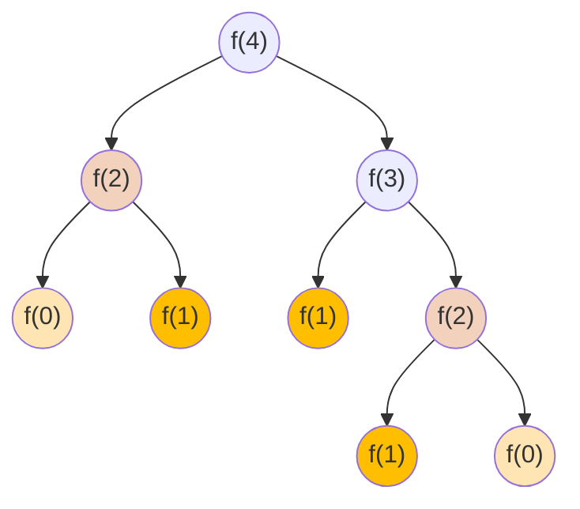

# Recursion

Recursion is a method of solving problems where the solution depends on solutions to
smaller instances of the same problem, achieved by a function calling itself within its
own code.

A recursive algorithm contains the following key components:

1. **Base Case**: when to stop the recursive function.
2. **Problem Decomposition**: breaks a complex problem into smaller, similar subproblems.
3. **Recursive Step**: calls itself with a modified input to solve subproblems, moving
toward the base case.

## Key points

- On the surface, function calls itself
- Essentially, boil down a big problem to smaller ones (size n depends on size n-1, or
n-2, ..., or n/2)
- Implementation:
    - Base case: smallest problem to solve
    - Recursive rule: how to make the problem smaller
- If recursive function calls are too deep (e.g., n or n^2), there isn't enough physical
memory to handle the increasingly growing stack, leading to a `StackOverflowError`. The
[Java docs](https://docs.oracle.com/javase/7/docs/api/java/lang/StackOverflowError.html)
have a good explanation of this, describing it as an error that occurs because an
application recurses too deeply. More over, recursive function call needs special
consideration when implementing on an embedded controller which has limited function
call stack.

## How Recursion Works Internally

- **Function Stack:**
    - Each time a function calls itself, a new stack frame is created.
    - The current state (local variables, node being processed, etc.) is saved on the stack
    until the function returns.
    - This is why recursion can use a lot of memory if the tree is deep, leading to a space
    complexity of **O(n)** in the worst case.

- **Returning to the Caller:**
    - After processing the left subtree, the function returns to the previous caller, where
    it resumes execution (processes the root, then the right subtree).
    - Recursion ensures that the execution "goes back" to the previous step in the
    correct order.

## How to Implement a Recursive Function

Before implementing a recursive function, need to figure out:

- **Recurrence relation**: the relationship between the result of a problem and the
result of its subproblems.
- **Base  case**: the case where the answer is directly computed or returned without any
further recursive calls.

For implementation, call the function itself according to the **recurrence relation**
until we reach the **base case**.

## Potential Issues: Duplicate Calculations

If not using recursion wisely, it might get very long computation time due to duplicate calculations.

For example, for computing Fibonacci number using simple recursion,
`F(4) = F(3) + F(2) = (F(2) + F(1)) + F(2)`, it computes `F(2)` twice, `F(1)` 3 times,
and `f(0)` twice.



The common technique to address this problem is [**memoization**](https://en.wikipedia.org/wiki/Binomial_coefficient),
using additional space to reduce compute time.

> Memorization is an optimization technique primarily to **speed up** computer program
by **storing** the results of expensive function calls and returning the cached result
when the same inputs occur again. (Source: wikipedia)

## Applications

### Solve Tree Problem Recursively

#### Top-Down Solution

**Top-down** means that in each recursive call, we will visit the node first to
come up with some values, and pass these values to its children when calling the
function recursively.

```pseudocode
top_down(root, params):
    return specific value for null node  # base case
    update the answer if needed
    left_ans = top_down(root.left, left_params)
    right_ans = top+down(root.right, right_params)
    return the answer if needed
```

Before trying the top-down recursive solution, ask the following two questions:

1. Can you determine some parameters to help the node know its answer?
2. Can you use these parameters and the value of the node itself to determine what
should be the parameters passed to its children.

#### Bottom-Up Solution

**Bottom-up** means that in each recursive call, we will first call the function
recursively for all the children nodes and then come up with the answer according to the
returned values and the value of the current node itself.

```pseudocode
bottom_up(root):
    return specific value for null node
    left_ans = bottom_up(root.left)
    right_ans = bottom_up(root.right)
    calculate answer based on left_ans, right_ans, root.val
    return answers
```

Before trying the bottom-up recursive solution, ask the following question:

- If you know the answer of a node's children, can you calculate the answer of that node?
