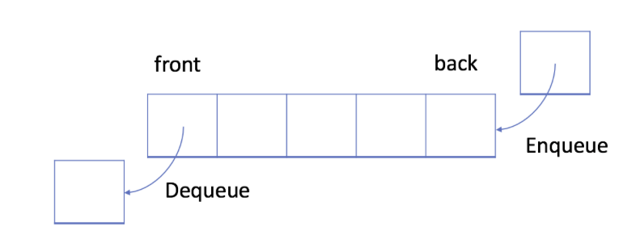

# Queue

## Introduction
The `queue` is a typical FIFO (first-in-first-out) data structure with two main operations:
- `Enqueue`: appends a new element to the queue
- `Dequeue`: removes the first element from the queue

## Implementation
Two different data structure can be used to implent the `queue`:
- array
- [linked list](../linked-list/linked-list.md)

## Different Types of Queue
- Circular queue (implemented using either [array](./circular_queue_array.py) of [linked list](../linked-list/circular_linked_list.py))
- Double-ended queue, `deque` (the name is ponounced as `deck`), allows appending and popping from either side of the queue with approximately $O(1)$ performance.

