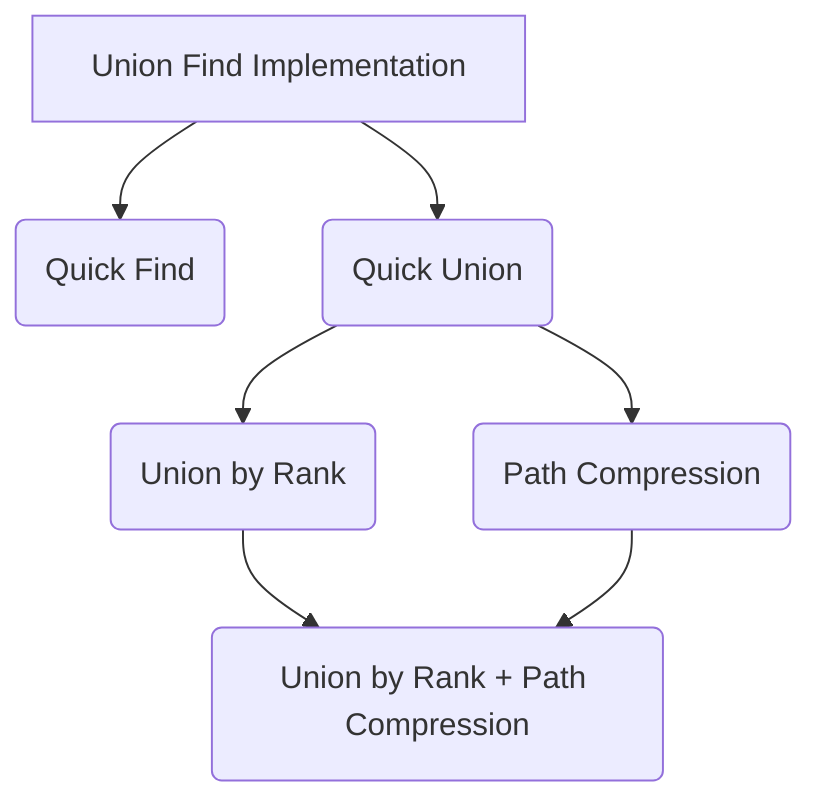

# Union-Find

## Introduction

The `union-find` data structure is also known as the `disjoint set` data structure.The primary use of disjoint sets is to address the connectivity between the components of a network.

The `union-find` transforms the problem of check whether vertices are connected to whether vertices have the same root node. There are two important functions:

- The `find` function finds the root node of a given vertex.
- The `union` function unions two vertices and makes their root nodes the same.

## Implementation

The various implementations focus on how to implement and optimize `find` and `union` functions.

```python
class UnionFind:
    def __init__(self, size):
    def find(self, x):
    def union(self, x, y):
    def connected(self, x, y):
```



### Quick Find Implementation

The array stores the `root` nodes.

=== "Python"
    ```python
    class UnionFind:
        def __init__(self, size):
            self.root = [i for i in range(size)]

        def find(self, x):
            return self.root[x]

        def union(self, x, y):
            root_x = self.find(x)
            root_y = self.find(y)
            if root_x != root_y:
                for i in range(len(self.root)):
                    if self.root[i] == root_y:
                        self.root[i] = root_x

        def connected(self, x, y):
            return self.find(x) == self.find(y)
    ```

#### Complexity of Quick Find

- Time complexity:
    - Union find constructor: $O(n)$, initialize an array of size $n$ with the values equal to the corresponding indices.
    - `find` function: $O(1)$
    - `union` function: $O(n)$, need to traverse the entire array and update the root vertices.
    - `connected` function: $O(1)$
- Space complexity: $O(n)$  
  The root array stores $n$ elements.

### Quick Union Implementation

The array stores either `parent` or `root` node.

=== "Python"
    ```python
    class UnionFind:
        def __init__(self, size):
            self.root = [i for i in range(size)]

        def find(self, x):
            while x != self.root[x]:
                x = self.root[x]
            return x

        def union(self, x, y):
            root_x = self.find(x)
            root_y = self.find(y)
            if root_x != root_y:
                self.root[root_y] = root_x

        def connected(self, x, y):
            return self.find(x) == self.find(y)
    ```

#### Complexity of Quick Union

- Time complexity:
    - Union find constructor: $O(n)$, initialize an array of size $n$ with the values equal to the corresponding indices.
    - `find` function: $O(n)$, in the worst case scenario, we need to traverse all $n$ vertices. For a balanced tree, it only needs to traverse the depth of the tree, i.e., $O(\log n)$.
    - `union` function: $O(n)$ in the worst case since it involves `find` function calls.
    - `connected` function: $O(n)$ in the worst case since it involves `find` function calls.
- Space complexity: $O(n)$  
  The root array stores $n$ elements.

### Union by Rank Implementation

This implementation improves `Quick Union` by optimizing the `union` function, choosing the parent node based on the height of each vertex. This can limit the maximum height of each vertex.

=== "Python"
    ```python
    class UnionFind:
        def __init__(self, size):
            self.root = [i for i in range(size)]
            self.rank = [1] * size

        def find(self, x):
            while x != self.root[x]:
                x = self.root[x]
            return x

        def union(self, x, y):
            root_x = self.find(x)
            root_y = self.find(y)
            if root_x != root_y:
                if self.rank[root_x] > self.rank[root_y]:
                    self.root[root_y] = root_x
                elif self.rank[root_x] < self.rank[root_y]:
                    self.root[root_x] = root_y
                else:  # root_x == root_y
                    self.root[root_y] = root_x
                    self.rank[root_x] += 1

        def connected(self, x, y):
            return self.find(x) == self.find(y)
    ```

#### Complexity of Quick by Rank

- Time complexity:
    - Union find constructor: $O(n)$, create and fill the `root` and `rank` arrays.
    - `find` function: $O(\log n)$ in the worst case where repeated union components of equal rank (double number of nodes) leads to logarithmic height growth.
    - `union` function: $O(\log n)$ in the worst case since it involves `find` function calls.
    - `connected` function: $O(\log n)$ in the worst case since it involves `find` function calls.
- Space complexity: $O(n)$  
  The `root` and `rank` arrays store $n$ elements each.

???+ "Logarithmic Height Growth"
    Because the rank only increases when both trees have the same rank (i.e., the number of nodes doubles each time we increase the height), the maximum height (rank) of any tree will be logarithmic in terms of the number of nodes, $n$. Specifically, after $k$ rank increases, the tree will have at least $2^k$ nodes. Thus, if we have $n$ nodes, the maximum height $h$ will satisfy, $2^h \leq n$, so $h = O(\log n)$.

### Path Compression Implementation

This implementation improves `Quick Union` by optimizing the `find` function with path compression. The path compression updates the parent node of all traversed elements to their root node. When searching for the root node of the same element again, only need to traverse two elements to find its root node.

=== "Python"
    ```python
    class UnionFind:
        def __init__(self, size):
            self.root = [i for i in range(size)]

        def find(self, x):
            if x == self.root[x]:
                return x
            self.root[x] = self.find(self.root[x])
            return self.root[x]

        def union(self, x, y):
            root_x = self.find(x)
            root_y = self.find(y)
            if root_x != root_y:
                self.root[root_y] = root_x

        def connected(self, x, y):
            return self.find(x) == self.find(y)
    ```

#### Complexity of Path Compression

- Time complexity:
    - Union find constructor: $O(n)$, create and fill the `root` array.
    - `find` function: $O(n)$ in the worst case and $O(\log n)$ on average, refer to [Top-Down Analysis of Path Coompression](https://www.cs.tau.ac.il/~michas/ufind.pdf) where R. Seidel and M. Sharir discuss the upper bound running time when path compression is used with arbitrary linking.
    - `union` function: $O(n)$ in the worst case and $O(\log n)$ on average, since it depends on `find` function calls.
    - `connected` function: $O(n)$ in the worst case and $O(\log n)$ on average, since it depends on `find` function calls.
- Space complexity: $O(n)$  
  The root array stores $n$ elements.

### Union by Rank + Path Compression Implementation

This implementation optimize the `quick union` with both `union by rank` and `path compression`.

=== "Python"
    ```python
    class UnionFind:
        def __init__(self, size)::
            self.root = [i for i in range(size)]
            self.rank = [1] * size  # (1)

        def find(self, x):  # (2)
            if x != self.root[x]:
                self.root[x] = self.find(self.root[x])
            return self.root[x]

        def union(self, x, y):  # (3)
            root_x = self.find(x)
            root_y = self.find(y)
            if root_x != root_y:
                if self.rank[root_x] > self.rank[root_y]:
                    self.root[root_y] = root_x
                elif self.rank[root_x] < self.rank[root_y]:
                    self.root[root_x] = root_y
                else:
                    self.root[root_y] = root_x
                    self.rank[root_x] += 1

        def connected(self, x, y):
            return self.find(x) == self.find(y)
    ```

    1. Use a rank array to store the height of each vertex with initial value of 1.
    2. Path compression optimization.
    3. Union by rank optimization.

#### Complexity of Union by Rank + Path Compression

- Time complexity:
    - Union find constructor: $O(n)$, create and fill the `root` and `rank` arrays.
    - `find` function: amortized time complexity is $O(\alpha(n))$, where $\alpha(n)$ is the inverse Ackermann function. The `Union by Rank` optimization keeps the tree shallow by attaching the smaller tree under the root of the larger tree. The rank (or approximate height) of each tree grows logarithmically, ensuring that trees stay balanced. The `Path Compression` optimization further flatten the structure by making visited node on the path directly connected to the root. The combination of `Union by Rank` and `Path Compression` ensures that the tree remains flat, and each node's depth is minimized over time.
    - `union` function: amortized time complexity is $O(\alpha(n))$ since it depends on the `find` function.
    - `connected` function: amortized time complexity is $O(\alpha(n))$ since it depends on the `find` function.
- Space complexity: $O(n)$  
  The `root` and `rank` arrays store $n$ elements each.

???+ "Inverse Ackermann Function"
    The Ackermann function, $A(m, n)$, grows so fast that for relatively small values of $m$ and $n$, the function produces enormous numbers. The inverse Ackermann function essentially "reverse" the Ackermann function to answer the question: "How many times do we need to apply the Ackermann function's recusion before reaching a certain value?"

    Formally, $\alpha(n)$ is the smallest integer $m$ such that $A(m, m) \geq n$. For any practical value of $n$, $\alpha(n)$ is extremely small. For example, if $n \leq 2^{65536}$, then $\alpha(n) \leq 5$.


???+ "Time-Complexity Analysis"
    Refer to [Cornell CS Union-Find lecture](https://www.cs.cornell.edu/courses/cs6110/2014sp/Handouts/UnionFind.pdf). Here is the [local copy](cornell-cs-union-find-lecture.pdf).

### Comparison of Different Implementations

The table below summarize the time complexity and space complexity of different
implementations:

Approach    | Constructor Time Complexity   | `find` Tme Complexity | `union` Time Complexity | `connected` Time Complexity | Space Complexity |
------------| ---------------   | ---------------- | ---------------- | ---------------- | ---------------- |
Quick Find  |  $O(n)$           | $O(1)$ | $O(n)$ | $O(1)$ | $O(n)$ |
Quick Union |  $O(n)$           | $O(n)$ worst, $O(h)$ average | $O(n)$ worst, $O(h)$ average | $O(n)$ worst, $O(h)$ average | $O(n)$ |
Union by Rank |  $O(n)$           | $O(\log n)$ | $O(\log n)$ | $O(\log n)$ | $O(n)$ |
Path Compression |  $O(n)$           | $O(n)$ worst, $O(\log n)$ average | $O(n)$ worst, $O(\log n)$ average | $O(n)$ worst, $O(\log n)$ average | $O(n)$ |
Union by Rank + Path Compression |  $O(n)$           | amortized $O(\alpha(n))$   | amortized $O(\alpha(n))$   | amortized $O(\alpha(n))$   | $O(n)$ |
