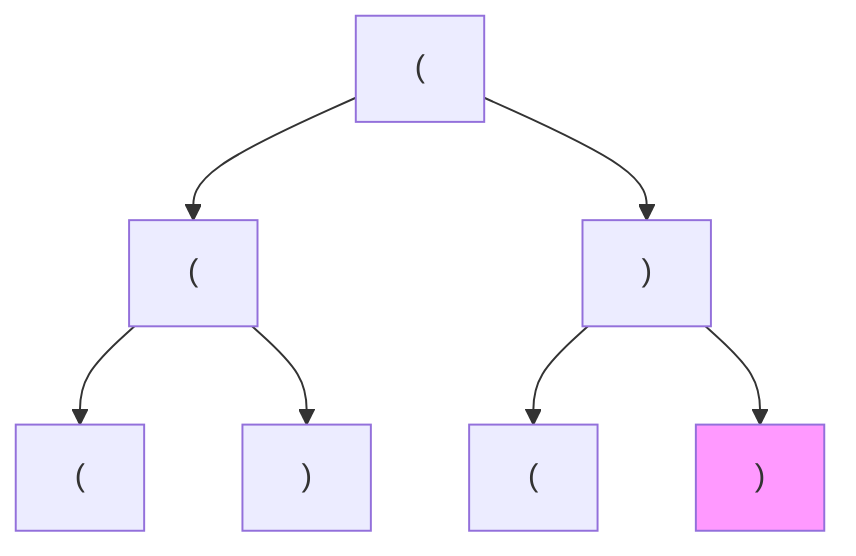

---
tags:
    - Backtracking
---

# 22. Generate Parentheses

## Problem Description

[LeetCode Problem 22](https://leetcode.com/problems/generate-parentheses/description/):
Given `n` pairs of parentheses, write a function to generate all combinations of
well-formed parentheses.

## Clarification

-

## Assumption

-

## Solution

### Approach 1: Backtracking

We can view the problem as a tree of choices. The root is `(`. At each step, we can
either add a left parenthesis `(` or a right parenthesis `)` based on conditions:

- Add a left parenthesis if we have not used all `n` left parentheses.
- Add a right parenthesis
    - if we have not used all `n` right parentheses.
    - if the number of right parentheses used is less than the number of left
    parentheses used. This ensures that the parentheses are well-formed



We can use backtracking to generate all combinations of well-formed parentheses.
If we encounter invalid combination, we backtrack to the previous step and try another option.

=== "Python"
    ```python
    class Solution:
        def generateParenthesis(self, n: int) -> List[str]:
            self.result = []
            self._generate([], n, n)
            return self.result

        def _generate(self, combination: list[str], n_left_remain: int, n_right_remain: int) -> None:
            # Base case
            if n_left_remain == 0 and n_right_remain == 0:
                self.result.append("".join(combination))
                return

            # Add left parenthesis
            if n_left_remain > 0:
                combination.append('(')
                self._generate(combination, n_left_remain - 1, n_right_remain)
                combination.pop()

            # Add right parenthesis and ensure valid combination
            if n_right_remain > 0 and n_left_remain < n_right_remain:
                combination.append(')')
                self._generate(combination, n_left_remain, n_right_remain - 1)
                combination.pop()
    ```

#### Complexity Analysis of Approach 1

- Time complexity: $O(\frac{4^n}{\sqrt{n}})$  
    - The number of valid combinations of parentheses is given by the Catalan number
    $C_n = \frac{1}{n+1}\binom{2n}{n} \approx \frac{4^n}{n^{3/2}\sqrt{\pi}}$.
    - Each valid combination takes $O(n)$ time to build, converting from list to string.
    - Therefore, the total time complexity is
    $O(C_n \cdot n) = O(\frac{4^n \cdot n}{n^{3/2}}) = O(\frac{4^n}{\sqrt{n}})$.
- Space complexity: $O(\frac{4^n}{\sqrt{n}})$  
    - The maximum depth of the recursion stack is $2n$ (since we append one character
    per call), which takes $O(n)$ space.
    - The result list store $C_n$ strings (all valid combinations) and each string
    contains $2n$ letters. So the result list takes $O(C_n \cdot 2n) = O(\frac{4^n}{\sqrt{n}})$
    space.
    - Therefore, the total space complexity is $O(n + C_n \cdot n) = O(\frac{4^n}{\sqrt{n}})$.

### Approach 2: 

Solution

=== "python"
    ```python
    code
    ```

#### Complexity Analysis of Approach 2

- Time complexity: $O(1)$  
  Explanation
- Space complexity: $O(n)$  
  Explanation

### Comparison of Different Approaches

The table below summarize the time complexity and space complexity of different
approaches:

Approach   | Time Complexity | Space Complexity
-----------|-----------------|-----------------
Approach 1 - Backtracking | $O(\frac{4^n}{\sqrt{n}})$          | $O(\frac{4^n}{\sqrt{n}})$
Approach 2 - | $O(1)$          | $O(n)$

## Test
