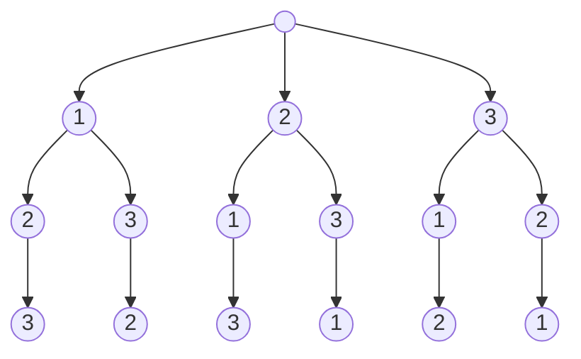

---
tags:
    - Backtracking
---

# 46. Permutations

## Problem Description

[LeetCode Problem 46](https://leetcode.com/problems/permutations/description/): Given an
array `nums` of distinct integers, return all the possible permutations. You can return
the answer in **any order**.

## Clarification

- Order matters (different from combinations)

## Assumption

-

## Solution

### Approach 1: Backtracking

The problem can be viewed as a **tree traversal** problem. The tree starts with an empty
root. Each level of the tree represents a position in the permutation. The children of
a node are the remaining numbers to fill the next level(position). When reaching the
leaf nodes (the last level of the tree), we have a complete permutation. Then we need
to **backtrack** to explore other branches of the tree.



=== "Python"
    ```python
    class Solution:
        def permute(self, nums: List[int]) -> List[List[int]]:
            self.results = []
            self._backtrack(nums, [])
            return self.results

        def _backtrack(self, nums: List[int], curr: List[int]) -> None:
            # Base case
            if len(curr) == len(nums):
                self.results.append(curr[:])  # Use [:] to add a copy of list

            for num in nums:
                if num not in curr:
                    curr.append(num)
                    self._backtrack(nums, curr)
                    curr.pop()
    ```

#### Complexity Analysis of Approach 1

- Time complexity: $O(n \cdot n!)$  
  The number of permutation of $n$ numbers is $n!$. For each permutation, we need to
  copy it to the final results, which takes $O(n)$ time. So the total time complexity
  is $O(n \cdot n!)$.
- Space complexity: $O(n!)$  
    - The final result store all permutations, which takes $O(n!)$ space.
    - The recursion stack takes $O(n)$ space since the depth is the number of elements
    of the input array.
    - The array `curr` takes $O(n)$ space since it stores the current permutation.
    - So the total space complexity is $O(n!) + O(n) + O(n) = O(n!)$.

## Test

- Test 2 numbers
- Test 3 numbers

