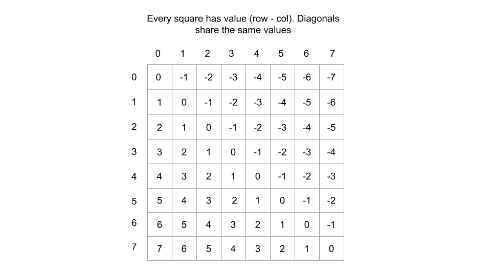
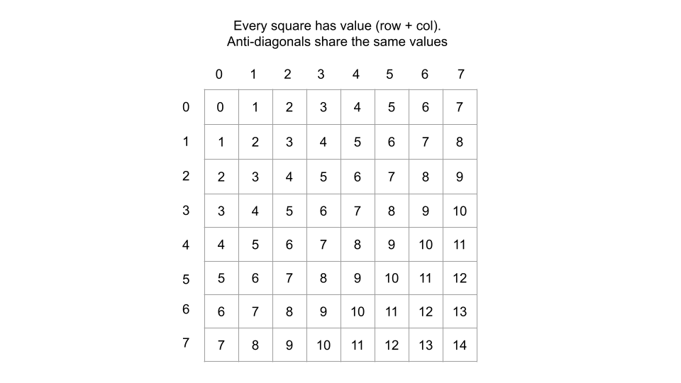

---
tags:
    - Backtracking
---

# 52. N-Queens II

## Problem Description

[LeetCode Problem 52](https://leetcode.com/problems/n-queens-ii/description/):
The **n-queens** puzzle requires placing `n` queens on an `n x n` chessboard such that no two queens attack each other.

Given an integer `n`, return the number of distinct solutions to the **n-queens puzzle**.

## Clarification

- The chessboard is of size `n x n`, where `n` is the number of queens.
- A queen can attack any square in the same row, column, or diagonal.

## Assumption

- `n` is a positive integer.

## Solution

### Approach 1: Backtracking

We solve the N-Queens problem using backtracking. The idea is to place a queen row by
row and recursively attempt to place queens in subsequent rows to build valid solutions.

- If a valid solution is found (i.e., all queens are placed), it is counted as one
distinct solution.
- If no valid placement exists in the current row, we **backtrack** by removing the last
placed queen and going back to previous row to try other possibilities.

A queen can attach any square in the same row, column, or diagonal. So we need to:

- Place 1 queen in each row.
- Place 1 queen in each column.
- Ensure no two queens are in each diagonal and anti-diagonal.

We start with placing 1 queen in each row and use sets to track columns, diagonals, and
anti-diagonals occupied by queens.

???- "How to check diagonal and anti-diagonal?"
    Get good explanations from [LeetCode editorial solution](https://leetcode.com/problems/n-queens-ii/editorial/).
    - The **diagonal** of a square is defined by the difference between its row and column
      indices. For example, the diagonal of (i, j) is `i - j`. If two squares have the same
      diagonal number, they are in the same diagonal line.

      

    - The **anti-diagonal** of a square is defined by the sum of its row and column indices. For
      example, the anti-diagonal of (i, j) is `i + j`. If two squares have the same anti-diagonal number,
      they are in the same anti-diagonal line.

      

=== "Python"
    ```python
    class Solution:
        def totalNQueens(self, n: int) -> int:
            return self.solve(n, 0, set(), set(), set())

        def solve(
            self,
            n: int,
            i_row: int,
            cols: set[int],
            diagonals: set[int],
            anti_diagonals: set[int],
        ) -> int:
            # Base case: All queens are placed
            if i_row == n:
                return 1

            n_solutions = 0
            for i_col in range(n):
                curr_diagonal = i_row - i_col
                curr_anti_diagonal = i_row + i_col
                # Check if the position is valid
                if (
                    i_col in cols
                    or curr_diagonal in diagonals
                    or curr_anti_diagonal in anti_diagonals
                ):
                    continue

                # Place the queen
                cols.add(i_col)
                diagonals.add(curr_diagonal)
                anti_diagonals.add(curr_anti_diagonal)

                # Recurse to the next row
                n_solutions += self.solve(n, i_row + 1, cols, diagonals, anti_diagonals)

                # Backtrack
                cols.remove(i_col)
                diagonals.remove(curr_diagonal)
                anti_diagonals.remove(curr_anti_diagonal)

            return n_solutions
    ```

#### Complexity Analysis of Approach 1

- **Time complexity**: $O(n!)$
    - Each queen must be placed in a different row and column.
    - The first queen can be placed in `n` columns, the second queen in `n-1` columns,
    and so on. So in the worst case, we have `n!` placements to check.
    - The backtracking algorithm prunes invalid placements early, reducing the number of
    recursive calls. The worst-case time complexity is still $O(n!)$, but the average
    case is much better.
- **Space complexity**: $O(n)$
    - Recursive call stack depth is `n` since placing 1 queen in each row. So call stack
    uses $O(n)$ space.
    - Hashsets stores the columns, diagonals, and anti-diagonals for at most $n$ queens:
        - `cols`: $O(n)$
        - `diagonals`: $O(n)$
        - `anti_diagonals`: $O(n)$
    - So the total space complexity is $O(n) + O(n) + O(n) + O(n) = O(n)$.

## Test
