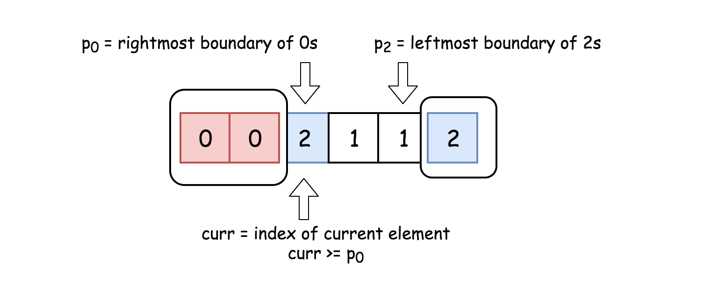

---
tags:
    - Array
    - Two Pointers
    - Sorting
---

 # LC75. Sort Colors
## Problem Description
[LeetCode Problem 75](https://leetcode.com/problems/sort-colors/): Given an array `nums` with `n` objects colored red, white, or blue, sort them **[in-place](https://en.wikipedia.org/wiki/In-place_algorithm)** so that objects of the same color are adjacent, with the colors in the order red, white, and blue.

We will use the integers `0`, `1`, and `2` to represent the color red, white, and blue, respectively

You must solve this problem without using the library's sort function.

## Clarification

## Assumption

## Solution
### Approach - Three Pointers
The problem is known as [Dutch National Flag Problem](https://en.wikipedia.org/wiki/Dutch_national_flag_problem) and first was proposed by [Edsger W. Dijkstra](https://en.wikipedia.org/wiki/Edsger_W._Dijkstra). We can use three pointers to solve the problem (or consider it as a dual-pivot partitioning sub-routine of quick sort algorithm, see the java solution below):
- One pointer, `p0`, to track the rightmost boundary of zeros
- Another pointer, `p2`, to track the leftmost boundary of twos
- The other pointer, `curr`, is for the current element under the consideration 



The idea is to move `curr` pointer along the array,  

- If `nums[curr] == 0`, swap it with `nums[p0]`  
- If `nums[curr] == 2`, swap it with `nums[p2]`  
- If `nums[curr]==1`, move forward

We know after swapping, we need to increase `p0`, i.e., `p0++`, and decrease `p2`, i.e., `p2--`. Yet, it is tricky to determine whether to increase `curr`.  

- If `nums[curr] == 2`, after swapping with `p2`, we should not increase `curr` since the number swapped from `p2` can be 0, 1, or 2, which needs to be further processed  
- If `nums[curr] == 0`, combine the below two cases, we should increase `curr`:  

	- If `curr == p0` as initialization, both pointers need to be increased, `curr++` and `p0++`  
	- If `curr > p0`, the number swapped back from `p0` can only be 1. As `curr` has passed `p0` (they were initialized same), the only way to separate these two when encountering 1. So leaving `curr` where it is (`curr == 1`, which will be increased in next execution) or increasing `curr`, does not make a difference. To cover both `curr > p0` and `curr == p0` conditions, we should use `curr++`.  

Another two conditions to consider:  

- `while` condition should use `curr <= p2` instead of `curr < p2`, since `curr == p2` is not processed yet. We need to decide whether it goes to p0, p2, or stay where it is.  
- When using **unsigned integer** for pointer, need to handle edge case of `p2` where `p2--` will cause overflow when `p2==0`.  

The problem can be considered as a dual-pivot partitioning sub-routine of quick sort algorithm (as shown in the Java solution below).

=== "Python"
    ```python
    class Solution:
        def sortColors(self, nums: List[int]) -> None:
            """
            Do not return anything, modify nums in-place instead.
            """
            p0, curr, p2 = 0, 0, len(nums) - 1

            while curr <= p2:
                if (nums[curr] == 0):
                    nums[p0], nums[curr] = nums[curr], nums[p0]
                    p0 += 1
                    curr += 1
                elif (nums[curr] == 2):
                    nums[p2], nums[curr] = nums[curr], nums[p2]
                    p2 -= 1
                else:
                    curr += 1
    ```

=== "C++"
    ```cpp
    class Solution {
    public:
        void sortColors(vector<int>& nums) {
            typedef vector<int>::size_type vec_size;
            vec_size p0 = 0;
            vec_size p2 = nums.size() - 1;
            vec_size curr = 0;

            while (curr <= p2) {
                if (nums[curr] == 0) {
                    swap(nums[curr++], nums[p0++]);
                }
                else if (nums[curr] == 2) {
                    if (p2 == 0) {
                        break; // handle unsigned int (0 - 1 case)
                    }
                    else {
                        swap(nums[curr], nums[p2--]);
                    }

                }
                else {
                    curr++;
                }
            }
        }
    };
    ```

=== "Java"
    ```java
    public void sortColors(int[] nums) {
        int lo = 0, hi = nums.length - 1, i = 0;

        while (i <= hi) {
            if      (nums[i] == 0) swap(nums, lo++, i++);
            else if (nums[i] == 2) swap(nums, i, hi--);
            else if (nums[i] == 1) i++;
        }
    }

    private void swap(int[] nums, int i, int j) {
        int t = nums[i];
        nums[i] = nums[j];
        nums[j] = t;
    }
    ```

#### Complexity Analysis
* Time complexity: $O(n)$  
	Since it is one pass along the array of length n. 
* Space complexity: $O(1)$  
	Only use 3 pointers, a constant space solution. 

## Test