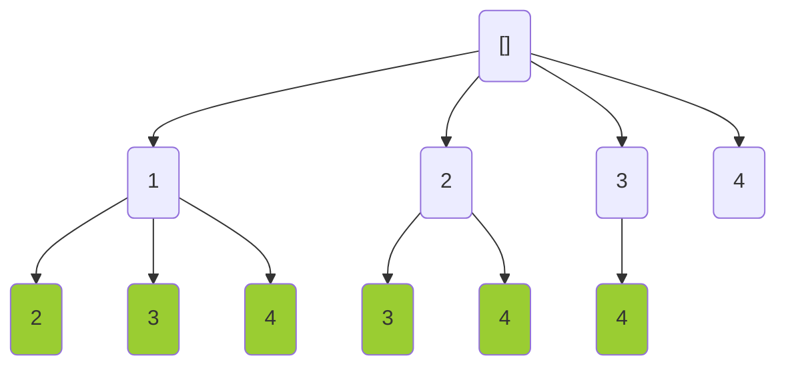

---
tags:
    - Backtracking
---

# 77. Combinations

## Problem Description

[LeetCode Problem 77](https://leetcode.com/problems/combinations/description/):
Given two integers `n` and `k`, return _all possible combinations of_ `k` _numbers
chosen from the range_ `[1, n]`.

You may return the answer in **any order**.

## Clarification

- Does the order matter? No, `[1, 2]` is the same as `[2, 1]`.

## Assumption

-

## Solution

### Approach 1: Backtracking

We can use backtracking to explore all possible combinations of numbers from `1` to `n`.
The idea is to build the combinations incrementally, adding one number at a time and
removing it if it doesn't lead to a valid combination. The algorithm explores all
possible combinations by recursively calling itself with the next number to be added.
The base case is when the length of the current combination equals `k`, at which point
we add the combination to the result list.

The best way to understand this problem is to visualize the backtracking process as a tree.

- The root node is empty, representing the initial state.
- The first level with $n$ nodes, representing the numbers from `1` to `n` that can be
chosen for the first position of the combination.
- To prevent duplicate combinations, each node only has children with numbers greater than
the current number. So from the 2nd level to $k + 1$th level, each node contains nodes
from `curr + 1` to `n` nodes.

The following diagram illustrates the tree structure:



Solving this problem is equivalent to finding all paths from the root node to the leaf nodes
of the tree. Each path represents a unique combination of numbers.

**Optimization**: There are some paths that don't lead to any solution
(e.g., node 4 in the tree diagram). We can avoid paths like these by limiting the range
of numbers to be considered. Instead of exploring all numbers from `1` to `n`, we can
limit the range to `[start, n - (k - len(path)) + 1]`. This ensures that we only
consider numbers that can be part of a valid combination. This optimization reduces the
number of recursive calls and speeds up the algorithm.

=== "Python"
    ```python
    class Solution:
        def combine(self, n: int, k: int) -> List[List[int]]:
            self.result = []
            self.n = n
            self.k = k
            self._backtrack(1, [])
            return self.result

        def _backtrack(self, start: int, path: list[int]) -> None:
            # Base case
            if len(path) == self.k:
                self.result.append(path[:])  # curr[:] makes a copy
                return

            # Optimization: No need to go beyond n - (k - len(path)) + 1
            end = self.n - (self.k - len(path)) + 1
            for num in range(start, end + 1):
                path.append(num)
                self._backtrack(num + 1, path)
                path.pop()
    ```

#### Complexity Analysis of Approach 1

- Time complexity: $O(C(n, k) \times k)$
    - The number of combinations is given by the binomial coefficient $C(n, k) = \frac{n!}{k!(n-k)!}$.
    - Each combination takes $O(k)$ time to copy it into the result list
    (when `len(path) == k`).
    - The total time complexity is $O(C(n, k) \times k)$.
- Space complexity: $O(C(n, k) \times k)$
    - Call stack space: at most, the recursion depth goes to $k$ since we stop once we
    have $k$ elements.
    - The path list stores at most $k$ elements.
    - The result list stores all combinations, which takes $O(C(n, k) \times k)$ space.
    - The total space complexity is
    $O(k) + O(k) + O(C(n, k) \times k) = O(C(n, k) \times k)$.

### Approach 2: 

Solution

=== "python"
    ```python
    code
    ```

#### Complexity Analysis of Approach 2

- Time complexity: $O(1)$  
  Explanation
- Space complexity: $O(n)$  
  Explanation

### Comparison of Different Approaches

The table below summarize the time complexity and space complexity of different
approaches:

Approach   | Time Complexity | Space Complexity
-----------|-----------------|-----------------
Approach - | $O(1)$          | $O(n)$
Approach - | $O(1)$          | $O(n)$

## Test

- Test `n = 1, k = 1`
- Test normal case `n = 4, k = 2`
