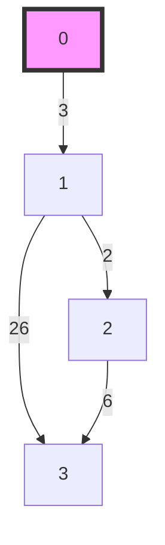

---
tags:
    - Dynamic Programming
---

# 91. Decode Ways

## Problem Description

[LeetCode Problem 91](https://leetcode.com/problems/decode-ways/description/): You have intercepted a secret message encoded as a string of numbers. The message is **decoded** via the following mapping:

`"1" -> 'A'   "2" -> 'B'   ...   "25" -> 'Y'   "26" -> 'Z'`

However, while decoding the message, you realize that there are many different ways you can decode the message because some codes are contained in other codes (`"2"` and `"5"` vs `"25"`).

For example, `"11106"` can be decoded into:

- `"AAJF"` with the grouping `(1, 1, 10, 6)`
- `"KJF"` with the grouping `(11, 10, 6)`
- The grouping `(1, 11, 06)` is invalid because `"06"` is not a valid code (only `"6"` is valid).

Note: there may be strings that are impossible to decode.

Given a string s containing only digits, return the **number of ways** to **decode** it. If the entire string cannot be decoded in any valid way, return `0`.

The test cases are generated so that the answer fits in a **32-bit** integer.

## Clarification

-

## Assumption

-

## Solution

### Approach 1: Dynamic Programming

This problem can be solved using dynamic programming:

- **State**: `dp[i]`: the number of ways to decode the substring `s[0:i]`
- **Transition**: at each position `i`, we look at the last **one digit** and the last
**two digits**.
    - **Single digit decode**:
        - valid if `s[i] != '0'`. Decode `s[i]` as one letter.
        - The number of ways to decode the first `i` characters is the same as the
        number of ways to decode the first `i-1` characters: `dp[i] = dp[i - 1]`.
    - **Two digits decode**:
        - valid if `10 <= s[i-1:i+1] <= 26`. Decode last two digits `s[i-1:i+1]` as one letter.
        - The number of ways to decode the first `i` characters is the same as the
        number of ways to decode the first `i-2` characters: `dp[i] = dp[i - 2]`.
    - So `dp[i] = dp[i - 1] + dp[i - 2]` if both single and two digits can be decoded.
- Base case:
    - dp(0) = 1, empty string has one way to decode.
    - dp(1) = 1 if `s[0] != '0'` else 0

=== "Python"
    ```python
    class Solution:
        def numDecodings(self, s: str) -> int:
            if s[0] == "0":
                return 0

            pprev = 1
            prev = 1
            for i in range(1, len(s)):
                curr = 0

                if s[i] != "0":
                    curr = prev

                # Check whether s[i-1: i+1] are valid
                if 10 <= int(s[i - 1 : i + 1]) <= 26:
                    curr += pprev

                prev, pprev = curr, prev

            return prev
    ```

#### Complexity Analysis of Approach 1

- Time complexity: $O(n)$  
  We iterate through the string once, performing constant-time operations for each character.
- Space complexity: $O(1)$  
  We only use a fixed amount of space for the variables `prev`, `pprev`, and `curr`.

### Approach 2: Graph Traversal

The problem can be visualized as a directed graph where each node represents a position in the string, and edges represent valid decoding steps. We can use a breadth-first search (BFS) or depth-first search (DFS) to explore all possible decoding paths.

Take "326" as a example:



=== "python"
    ```python
    from collections import deque

    class Solution:
        def numDecodings(self, s: str) -> int:
            if not s or s[0] == '0':
                return 0

            # BFS initialization
            queue = deque([0])  # Start from the first character
            count = 0

            while queue:
                i = queue.popleft()
                if i == len(s):
                    count += 1
                    continue

                # Single digit decode
                if s[i] != '0':
                    queue.append(i + 1)

                # Two digits decode
                if i + 1 < len(s) and 10 <= int(s[i:i + 2]) <= 26:
                    queue.append(i + 2)

            return count
    ```

#### Complexity Analysis of Approach 2

- Time complexity: $O(1)$  
  Explanation
- Space complexity: $O(n)$  
  Explanation

### Comparison of Different Approaches

The table below summarize the time complexity and space complexity of different
approaches:

Approach   | Time Complexity | Space Complexity
-----------|-----------------|-----------------
Approach - Dynamic Programming | $O(n)$          | $O(1)$
Approach - | $O(1)$          | $O(n)$

## Test
