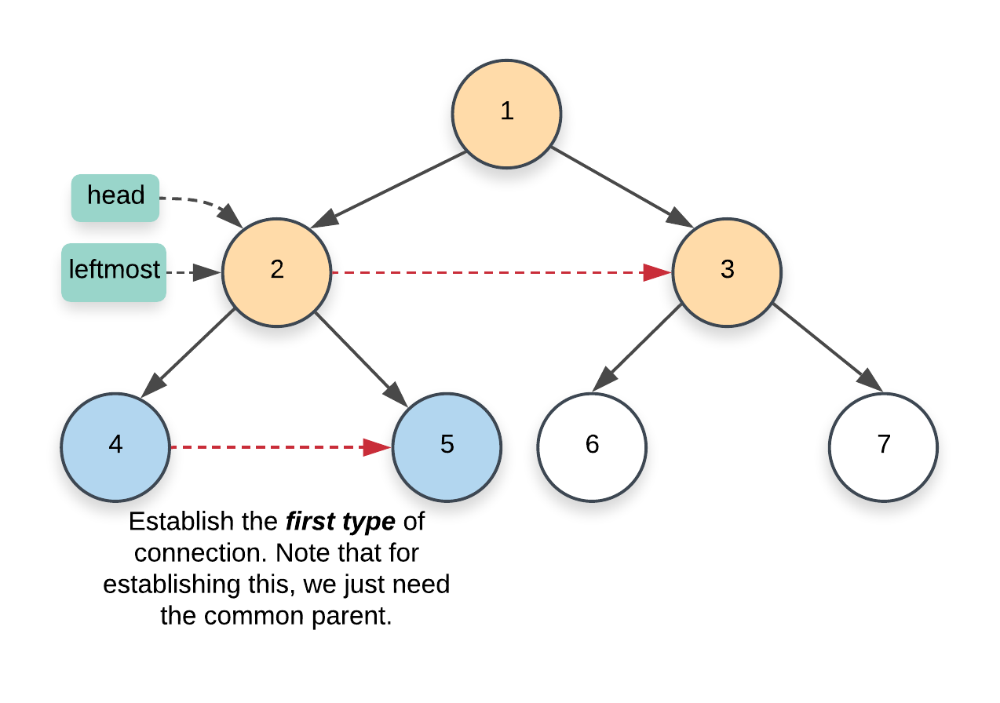
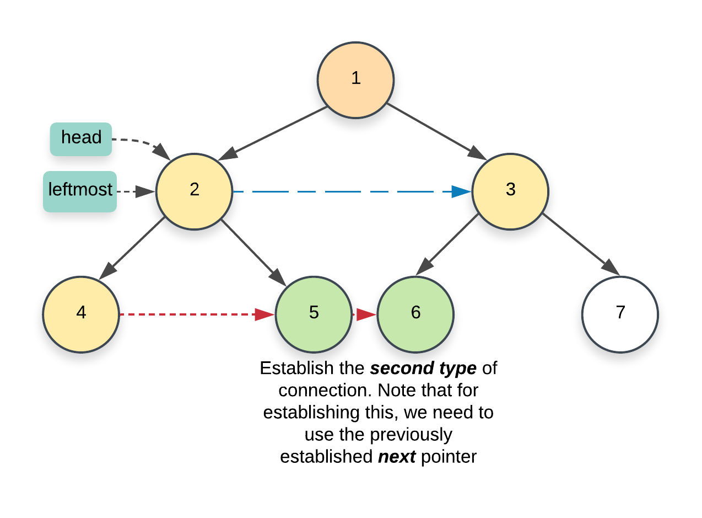

---
tags:
    - Breadth-First Search
---

# LC116. Populating Next Right Pointers in Each Node

## Problem Description

[LeetCode Problem 116](https://leetcode.com/problems/populating-next-right-pointers-in-each-node): You are given a **perfect binary tree** where all leaves are on the same level, and every parent has two children. The binary tree has the following definition:

struct Node {
  int val;
  Node *left;
  Node *right;
  Node *next;
}

Populate each next pointer to point to its next right node. If there is no next right node, the next pointer should be set to `NULL`.

Initially, all next pointers are set to `NULL`.

## Clarification

- Perfect binary tree
- What does it mean to populate each next pointer to point to its next right node?
  binary tree alreay uses left and right. Update the next node to point to the right node. If not exist, set it to Null

## Assumption

-

## Solution

### Approach - BFS

We can use BFS to traverse nodes level by level by using a queue. For each level, pop the node and update its next node with the first node in the queue (using peek) and add its left and right nodes to the queue if exists. If no next node available, update the next with null.

=== "Python"
    ```python
    class Solution:
        def connect(self, root: 'Optional[Node]') -> 'Optional[Node]':
            if not root:
                return root

            queue = deque([root])

            while queue:
                size = len(queue)
                for i in range(size):
                    node_i = queue.popleft()

                    # Update next node
                    if i < size - 1:
                        node_i.next = queue[0]

                    # Add left and right nodes to the queue
                    if node_i.left:
                        queue.append(node_i.left)
                    if node_i.right:
                        queue.append(node_i.right)

            return root
    ```

#### Complexity Analysis of Approach 1

- Time complexity: $O(n)$  
  Each node is processed exactly once. For processing each node, it takes $O(1)$ time to popping the node from the queue and establishing the next pointer.
- Space complexity: $O(n)$  
  Since it is a perfect binary tree which means the last level contains $n/2$ nodes. So the space complexity of the queue depends on the maximum number of nodes in particular level, i.e., the last level. So the time complexity is $O(n/2) = O(n)$.

### Approach 2 - Use established next pointers in upper level

Refer to detailed explanations in [LC Editorial section](https://leetcode.com/problems/populating-next-right-pointers-in-each-node/editorial/).

The main idea is when at level $k - 1$, establishes the next pointers for level $k$. Once done with connections , move to level $k$ and do the same thing for $k + 1$. Note that for level `0`, it only has one root node and the next pointer is already established.

When traverse a particular level with nodes connected. Think of nodes on that level formulate a linked list with head on the leftmost node.

When establish connections in the next level, there are two types of `next` pointer connections:

- connection between the two children of a given node.

{: style="width:450px"}

- connection between nodes which have a different parent.

{: style="width:450px"}


=== "python"
    ```python
    class Solution:
      def connect(self, root: 'Optional[Node]') -> 'Optional[Node]':
          if not root:
              return root

          leftmost = root

          # It's done when reaching the final level
          while leftmost.left:

              # Establishing the corresponding links for the next level
              head = leftmost
              while head:
                  # Link left and right children nodes
                  head.left.next = head.right

                  # Link children nodes between two parent nodes
                  if head.next:
                      head.right.next = head.next.left

                  head = head.next

              # Move to the next level
              leftmost = leftmost.left

          return root
    ```

#### Complexity Analysis of Approach 2

- Time complexity: $O(n)$  
  Similar to solution 1, it process $n$ nodes exactly once.
- Space complexity: $O(1)$  
  No additional data structure used.

### Comparison of Different Approaches

The table below summarize the time complexity and space complexity of different approaches:

Approach    | Time Complexity   | Space Complexity |
------------| ---------------   | ---------------- |
Approach 1 - BFS  |  $O(n)$           | $O(n)$ |
Approach 2 - Use Established Next Connections |  $O(n)$           | $O(1)$  |

## Test
