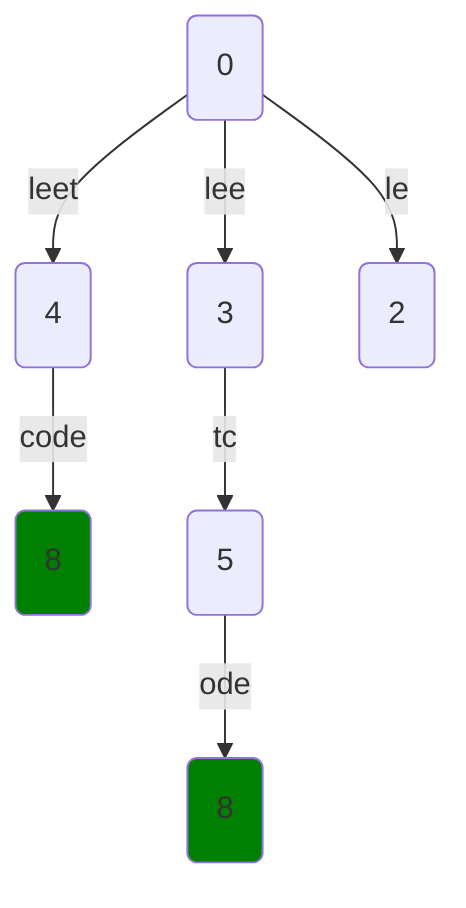

---
tags:
    - Breadth-First Search
    - Dynamic Programming
---

# 139. Word Break

## Problem Description

[LeetCode Problem 139](https://leetcode.com/problems/word-break/editorial/): Given a
string `s` and a dictionary of strings `wordDict`, return `true` if `s` can be segmented
into a space-separated sequence of one or more dictionary words.

**Note** that the same word in the dictionary may be reused multiple times in the segmentation.

## Clarification

-

## Assumption

-

## Solution

### Approach 1: Breadth-First Search

The process of segmenting a string into a sequence of words can be modeled as a **graph** where

- **each node** represents a position (i.e., **index**) in the string. When reaching
node with index `i`, it means `s[0:i]` (`i` is excluded) is successfully segmented into
a sequence
of valid words.
- **each edge** represents a **word**, `s[i:j]` from the dictionary, where `i` is index
in parent node and `j` is index in a child node.

We can use the BFS approach to explore all possible paths from the start index (`0`) to the
end index of the string (`len(s)`). If we find a path that reaches the end of the string,
we return `True`. If we exhaust all possible paths, we return `False`.



=== "Python"
    ```python
    from collections import deque

    class Solution:
        def wordBreak(self, s: str, wordDict: List[str]) -> bool:
            queue = deque([0])  # start index
            seen = set()

            while queue:
                start =  queue.popleft()
                if start == len(s):
                    return True

                for word in wordDict:
                    end = start + len(word)
                    if end > len(s) or end in seen:
                        continue

                    if s[start:end] == word:
                        queue.append(end)
                        seen.add(end)

            return False
    ```

#### Complexity Analysis of Approach 1

- Time complexity: $O(n \cdot k \cdot m)$ where $n$ is the length of the string, $k$ is
the number of words in the dictionary, and $m$ is the maximum length of the words.
    - In the worst case, we may visit each index of string `s` (i.e., each node) at most
    once, which is $O(n)$.
    - For each index (node),
        - try all `k` words,
        - each word check costs $O(m)$ due to string slicing `s[start:end]`.
    - The total cost is $O(n \cdot k \cdot m)$.
- Space complexity: $O(n)$  
    - `queue` holds at most $O(n)$ indices.
    - `seen` holds at most $O(n)$ indices.
    - The total cost is $O(n) + O(n) = O(n)$.

### Approach 2: Top-Down Dynamic Programming

The problem can also be solved using a top-down dynamic programming approach with memoization.

- **State**: `dp[i]` is `True` if the substring `s[0:i]` (`i` is not included) can be segmented into a
sequence of
valid words.
- **Transition**: For each index `i`, we need to check two conditions:
    1. If `s[j:i]` is a valid word in the dictionary, where `j` is any index from `0` to `i`.
    2. If `dp[j]` is `True`, meaning the substring `s[0:j]` can be segmented into valid words.  
    So the transition can be expressed as: `dp[i] = any(s[i - len(word) : i] == word and dp[i - len(word)] for word in words)`
- **Base Case**: `dp[i] = True` for `i <= 0` because we can build an empty string from
no words.

=== "python"
    ```python
    class Solution:
        def wordBreak(self, s: str, wordDict: List[str]) -> bool:
            return self._wordBreak(s, tuple(wordDict), len(s))

        @cache
        def _wordBreak(self, s: str, words: Tuple[str], end: int) -> bool:
            if end <= 0:
                return True

            for word in words:
                if s[end - len(word) : end] == word and self._wordBreak(s, words, end - len(word)):
                    return True

            return False
    ```

#### Complexity Analysis of Approach 2

- Time complexity: $O(n \cdot k \cdot m)$  
    - There are at most $n$ states of `dp[i]` and we only calculate each state once due
    to memoization($O(n)$).
    - The input `wordDict` is converted to a tuple, which is immutable and can be used as a cache key, which is $O(k)$
    - For each state,
        - try all `k` words,
        - each word check costs $O(m)$ due to string slicing `s[start:end]`.
    - The total cost is $O(k) + O(n \cdot k \cdot m) = O(n \cdot k \cdot m)$.
- Space complexity: $O(n)$  
    - The memoization cache stores at most $O(n)$ states.
    - The input `wordDict` is converted to a tuple, which takes $O(k)$.
    - The recursion stack can go up to $O(n)$ deep.
    - The total cost is $O(n) + O(k) + O(n) = O(n)$.

### Approach 3: Bottom-Up Dynamic Programming

The problem can also be solved using a bottom-up dynamic programming approach. We will use

- an array `dp` where `dp[i]` is `True` if the substring `s[0:i + 1]` (`i` is included
but not `i + 1`) can be segmented into a sequence of valid words.
- the same recurrence relation `dp[i] = any(s[i - len(word) + 1 : i] == word and dp[i - len(word)] for word in words)`

Note that `dp[i]` is slightly different from the previous approaches. Here, `dp[i]` is
`True` if the substring `s[0:i + 1]` can be segmented into valid words, while in the
previous approaches, `dp[i]` is `True` if the substring `s[0:i]` can be segmented into
valid words. Both approaches are equivalent. Just want to show different definitions of `dp[i]`.

=== "python"
    ```python
    class Solution:
    def wordBreak(self, s: str, wordDict: List[str]) -> bool:
        dp = [False] * len(s)
        for i in range(len(s)):
            for word in wordDict:
                # Handle out of bounds case
                if i < len(word) - 1:
                    continue

                if i == len(word) - 1 or dp[i - len(word)]:
                    if s[i - len(word) + 1 : i + 1] == word:
                        dp[i] = True
                        break

        return dp[-1]
    ```

#### Complexity Analysis of Approach 3

- Time complexity: $O(n \cdot k \cdot m))$  
  Similar to previous approaches, we calculate $O(n)$ states in total and each state
  takes $O(m \cdot k)$ to compute.
- Space complexity: $O(n)$  
  We use an array `dp` of size $O(n)$ to store the results of subproblems.

### Comparison of Different Approaches

The table below summarize the time complexity and space complexity of different
approaches:

Approach   | Time Complexity | Space Complexity
-----------|-----------------|-----------------
Approach - BFS | $O(n \cdot k \cdot m)$          | $O(n)$
Approach - Top-Down Dynamic Programming | $O(n \cdot k \cdot m)$          | $O(n)$
Approach - Bottom-Up Dynamic Programming | $O(n \cdot k \cdot m)$          | $O(n)$

## Test

- Test empty string and empty dictionary: `wordBreak("", [])` should return `True`.
- Test single character string and single character dictionary: `wordBreak("a", ["a"])` should return `True`.
- Test single character string and empty dictionary: `wordBreak("a", [])` should return `False`.
- Test string that can be segmented: `wordBreak("leetcode", ["leet", "code"])` should return `True`.
- Test string that cannot be segmented: `wordBreak("leetcode", ["leet", "c"])` should return `False`.
