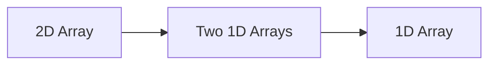
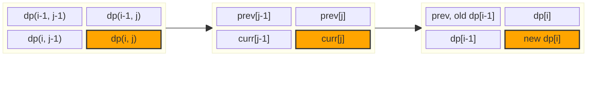

---
tags:
    - Dynamic Programming
---

# 221. lc0221 maximal square

## Problem Description

[LeetCode Problem 221](https://leetcode.com/problems/maximal-square/description/):
Given an `m x n` binary `matrix` filled with `0`'s and `1`'s, _find the largest square
containing only_ `1`'s _and return its area_.

## Clarification

-

## Assumption

- The matrix is not square
- Need to find the largest square
- Area (width x height)
- The matrix could be empty

## Solution

### Approach 1: Dynamic Programming

To form a square `k + 1` at `(i, j)`, we need to ensure that:

- A square of size `k` exists **above**, `(i - 1, j)`
- A square of size `k` exists **to the left**, `(i, j - 1)`
- A square of size `k` exists **diagonally top-left**, `(i - 1, j - 1)`

```text
1 1
1 X   ← we're at X = (i,j)

⬉  ↑
←  [i,j]
```

This problem can be solved using dynamic programming:

- **State**: `dp(i, j)` represents the side length of the largest square whose
bottom-right corner is at `(i, j)` in the input matrix.
- **State Transition**:
    - If `matrix[i][j] == "1"`, then `dp(i, j)` is the minimum of the top, left, and
    top-left neighbors plus one:
    `dp(i, j) = min(dp(i-1, j), dp(i, j-1), dp(i-1, j-1)) + 1`
    - If `matrix[i][j] == "0"`, then: `dp(i, j) = 0`
- **Base Case**: If `i == 0` or `j == 0`, then `dp(i, j) = matrix[i][j]` (if it's "1")
or `0` (if it's "0").

For the space complexity optimization, we can

- Start from a **2D array** of size `(m + 1) x (n + 1)` for better understanding
- Reduce it to **two 1D arrays** of size `n + 1`, one for the current row and one for
the previous row
- Further reduce it to a single 1D array of size `n + 1`. It is tricky to understand and
implement it correctly. 





=== "Python - 2D Array"
    ```python
    class Solution:
        def maximalSquare(self, matrix: List[List[str]]) -> int:
            n_rows = len(matrix)
            n_cols = len(matrix[0]) if n_rows else 0
            dp = [
                [0] * (n_cols + 1) for _ in range(n_rows + 1)
            ]  # Add extra rows and columns to facility dp computations for the first row and the first column in matrix
            max_sq_len = 0
            for i in range(n_rows):
                for j in range(n_cols):
                    if matrix[i][j] == "1":
                        dp[i + 1][j + 1] = (
                            min([dp[i][j + 1], dp[i + 1][j], dp[i][j]]) + 1
                        )  # Be careful of the indexing, (i, j) in matrix correspond to (i + 1, j + 1) in dp
                        max_sq_len = max(max_sq_len, dp[i + 1][j + 1])

            return max_sq_len * max_sq_len
    ```

=== "Python - Two 1D Arrays"
   ```python
   class Solution:
        def maximalSquare(self, matrix: List[List[str]]) -> int:
            if not matrix or not matrix[0]:
                return 0

            n_rows, n_cols = len(matrix), len(matrix[0])
            prev = [0] * (n_cols + 1)
            max_side = 0

            for i in range(1, n_rows + 1):
                curr = [0] * (n_cols + 1)
                for j in range(1, n_cols + 1):
                    if matrix[i - 1][j - 1] == "1":
                        curr[j] = min(prev[j - 1], prev[j], curr[j - 1]) + 1
                        max_side = max(max_side, curr[j])
                prev = curr

            return max_side * max_side
   ```

=== "Python"
    ```python
    class Solution:
        def maximalSquare(self, matrix: List[List[str]]) -> int:
            if not matrix:
                return 0
            n_rows, n_cols = len(matrix), len(matrix[0])

            dp = [0] * (n_cols + 1)
            max_sq_len = 0
            prev = 0
            for i in range(n_rows):
                for j in range(n_cols):
                    temp = dp[j + 1]
                    if matrix[i][j] == "1":
                        dp[j + 1] = min([dp[j + 1], dp[j], prev]) + 1
                        max_sq_len = max(max_sq_len, dp[j + 1])
                    else:
                        dp[j + 1] = 0
                    prev = temp

            return max_sq_len * max_sq_len
    ```

#### Complexity Analysis of Approach 1

- Time complexity: $O(m \times n)$  
  We need to iterate through each cell in the matrix once.
- Space complexity: $O(n)$ for 1D array implementation, $O(m \times n)$ for 2D array
implementation  
    - For 2D array implementation, we use a 2D array of size $(m + 1) \times (n + 1)$.
    - For two 1D arrays implementation, we use two 1D arrays of size $n + 1$.
    - For 1D array implementation, we use a 1D array of size $n + 1$.

## Test

- Test empty matrix
- Test matrix with single row or single column
- Test matrix with all "0"s
- Test matrix with all "1"s
- Test matrix with mixed "0"s and "1"s