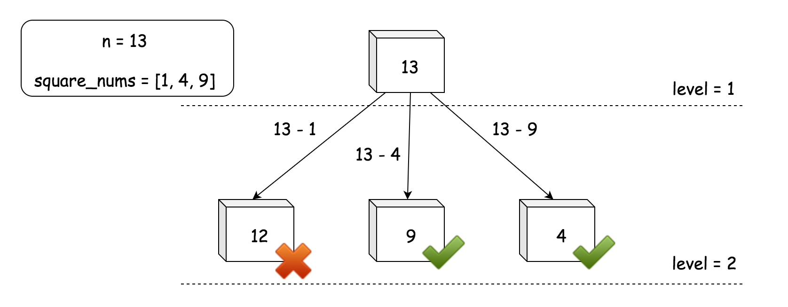

---
tags:
    - Breadth-First Search
---

# LC279. Perfect Squares
## Problem Description
[LeetCode Problem 279](https://leetcode.com/problems/perfect-squares/): Given an integer `n`, return _the least number of perfect square numbers that sum to_ `n`.

A **perfect square** is an integer that is the square of an integer; in other words, it is the product of some integer with itself. For example, `1`, `4`, `9`, and `16` are perfect squares while `3` and `11` are not.

## Clarification
- definition of perfect square number

## Assumption
- integer is positive

## Solution
### Approach - BFS
Add the current node to the graph and go through all perfect square < node, add remain value (node - square value) to the queue. Then go layer by layer until find a number that is perfect square. The number of steps is the least number of perfect squares



The above image is from [editorial solution](https://leetcode.com/problems/perfect-squares/editorial/).

=== "Python"
    ```python
    from collections import deque
    import math

    class Solution:
        def numSquares(self, n: int) -> int:
            queue = deque()
            visited = set()

            queue.append(n)
            visited.add(n)
            count = 1

            while queue:
                current_level_node_count = len(queue)
                for _ in range(current_level_node_count):
                    value = queue.popleft()
                    sqrt_value = math.isqrt(value)
                    if value == sqrt_value ** 2:
                        return count

                    for i_sqrt in range(1, sqrt_value + 1):
                        remain_value = value - i_sqrt ** 2
                        if remain_value not in visited:
                            queue.append(remain_value)
                count += 1

            return 0
    ```

#### Complexity Analysis
* Time complexity: $O(n \sqrt{n})$ or $O(n)$  
	In the worst case, it will explore $n$ nodes. So time complexity is $O(n)$. Additional information:

    - 4-Square theorem: Every natural no is sum of 4 squares.
    - Python `math.isqrt` run time is $O((\log(n))^(\log(3)/\log(2)))$, as explained in this [article](https://stackoverflow.com/questions/78063269/time-complexity-of-python-3-8s-integer-square-root-math-isqrt-function#:~:text=As%20a%20result%2C%20the%20running,number%20of%20bits%20of%20n%20.).
* Space complexity: $O(\sqrt{n})$  
	In the worst case, both queue and set will store values of number, $\sqrt{n}$.


## Test