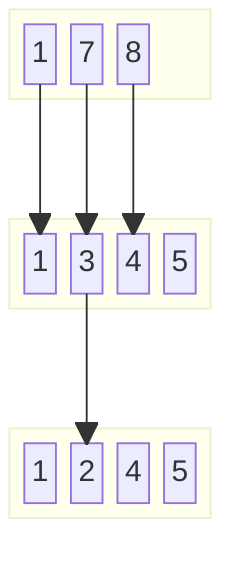

---
tags:
- Dynamic Programming
- Binary Search
---

# LC300. Longest Increasing Subsequence

## Problem Description

[LeetCode Problem 300](https://leetcode.com/problems/longest-increasing-subsequence): Given an integer array `nums`, return _the length of the longest **strictly increasing subsequence**.

## Clarification

- strictly increasing? > not >=
- is it continuous subsequence?

## Assumption

## Solution

### Approach - Dynamic Programming

The problem can be solved using dynamic programming:

- **State**: let `dp[i]` be the length of the longest increase subsequence that ends
with the i-th element, `nums[0], nums[k], ..., nums[i]`.
- **Transition**: for each `i`, we can find the longest increasing subsequence that
ends with `nums[i]` by checking all previous elements `j` (where `j < i`) and
updating `dp[i]` as follows: `dp[i] = max(dp[i], dp[j] + 1)` for all `j < i` where `nums[j] < nums[i]`.
- **Base case**: `dp[i]` will be initialized to 1 since we can always pick a single
element for the sequence.

=== "Python"
    ```python
    class Solution:
        def lengthOfLIS(self, nums: List[int]) -> int:
            n = len(nums)
            dp = [1] * n
            for i in range(n):
                for j in range(i):
                    if nums[i] > nums[j] and dp[i] < dp[j] + 1:
                        dp[i] = dp[j] + 1
            return max(dp)
    ```

#### Complexity Analysis

- Time complexity: $O(n^2)$  
Use two nested for-loops, resulting in $1 + 2 + ... + n = \frac{n(n+1)}{2}$ operations.

- Space complexity: $O(n)$  
`dp` array to store values.

### Approach - Binary Search

[@hiepit](https://leetcode.com/problems/longest-increasing-subsequence/solutions/1326308/c-python-dp-binary-search-bit-segment-tree-solutions-picture-explain-o-nlogn/?envType=study-plan-v2&envId=binary-search)
provides a good explanations. He also mention [another useful document](https://www.cs.princeton.edu/courses/archive/spring13/cos423/lectures/LongestIncreasingSubsequence.pdf)
for better understanding.

The idea is to build an increasing subsequence by:

- If the current number is larger than the last number in the subsequence, append it.
- If it is smaller, find the first number in the subsequence that is larger than or
equal to the current number and replace it with the current number.
The replacement maintains the existing length and allows for a potentially longer
subsequence in the future.

For example, with the input `[1, 7, 8, 3, 4, 5, 2]`, the subsequence will be built as follows:



Note that this approach does not actually build a valid subsequence, but the length of
the subsequence is always equal the length of the longest increasing subsequence.
As shown in the above example, the final subsequence is `[1, 2, 4, 5]` but the correct
sequence is `[1, 3, 4, 5]`.  Both have the same length.

=== "Python"
    ```python
    class Solution:
        def lengthOfLIS(self, nums: List[int]) -> int:
            sub = []
            for x in nums:
                if len(sub) == 0 or sub[-1] < x:
                    sub.append(x)
                else:
                    idx = bisect_left(sub, x)  # Find the index of the first element >= x
                    sub[idx] = x  # Replace that number with x
            return len(sub)
    ```

#### Complexity Analysis

- Time complexity: $O(n \log n)$  
Iterate the array $n$ times and each iteration takes $O(\log n)$ by using binary search.

- Space complexity: $O(n)$  
Need space to store sub array.

### Comparison of Different Approaches

The table below summarize the time complexity and space complexity of different approaches:

Approach   | Time Complexity  | Space Complexity  
------------ | ---------------  | ----------------
Approach - Dynamic Programming |  $O(n^2)$          | $O(n)$  
Approach - Binary Search |  $O(n \log n)$        | $O(n)$

## Test

- Test normal cases
- Test edge cases:
    - Empty array
    - Single element array
    - All elements are the same
    - Already sorted array
    - Reverse sorted array