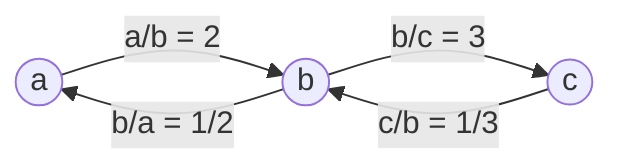
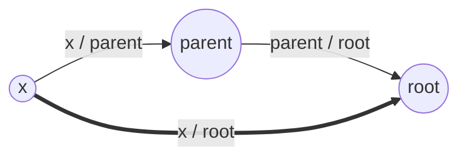
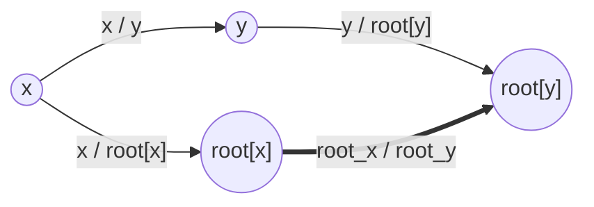
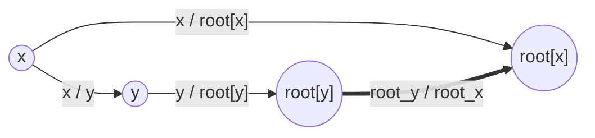

---
tags:
    - Breadth-First Search
    - Depth-First Search
    - Union Find
---

# LC399. Evaluate Division

## Problem Description

[LeetCode Problem 399](https://leetcode.com/problems/evaluate-division/description/):
You are given an array of variable pairs `equations` and an array of real numbers
`values`, where `equations[i] = [Ai, Bi]` and `values[i]` represent the equation 
`Ai / Bi = values[i]`. Each `Ai` or `Bi` is a string that represents a single variable.

You are also given some `queries`, where `queries[j] = [Cj, Dj]` represents the `jth`
query where you must find the answer for `Cj / Dj = ?`.

Return _the answers to all queries_. If a single answer cannot be determined, return
`-1.0`.

**Note:** The input is always valid. You may assume that evaluating the queries will not
result in division by zero and that there is no contradiction.

**Note:** The variables that do not occur in the list of equations are undefined, so the
answer cannot be determined for them.

## Clarification

- A single answer for one query?

## Assumption

- No contradiction
- No division by zero

## Solution

We can transform the equations into directed weighted graph, where each variable is a
vertex and the division relationship between variables is edge with direction and
weight. The direction of edge indicates the order of division and the weight of edge
indicates the result of division.

For example, the equations $a / b = 2$ and $b / c = 3$ can be represented in the
following graph.



To evaluate a query is equivalent to perform two task:

1. find if there exists a path between the two vertices;
2. If exists, calculate the cumulative product along the path.

### Approach 1 - BFS/DFS

First build the directed weighted graph from equations. Then we can use either
Breadth-First Search (BFS) or Depth-First Search (DFS) to find the path between two
nodes and calculate the cumulative product along the path if exists.

=== "Python - BFS"
    ```python
    from collections import defaultdict, deque


    class Solution:
        def calcEquation(
            self, equations: List[List[str]], values: List[float], queries: List[List[str]]
        ) -> List[float]:

            #  (1)
            graph = defaultdict(list)
            for (num, den), value in zip(equations, values):
                graph[num].append((den, value))
                graph[den].append((num, 1.0 / value))

            results = [-1] * len(queries)
            for i, (num, den) in enumerate(queries):
                if num in graph and den in graph:
                    results[i] = self.bfs(num, den, graph)

            return results

        def bfs(self, start_node: str, end_node: str, graph: dict[dict]) -> float:
            visited = set([None, start_node])
            queue = deque([(start_node, 1.0)])  #  (2)

            while queue:
                curr_node, cum_product = queue.popleft()
                if curr_node == end_node:
                    return cum_product

                for next_node, next_value in graph[curr_node]:
                    if (curr_node, next_node) not in visited:
                        visited.add((curr_node, next_node))
                        queue.append((next_node, cum_product * next_value))

            return -1.0  #  (3)
    ```

    1. Build directional graph with weights from the equations. Use dict of list to
    store node to node connections and weights.
    2. Store `(node, cumulative product)`.
    3. Not find end node

=== "Python - DFS"
    ```python
    from collections import defaultdict, deque


    class Solution:
        def calcEquation(
            self, equations: List[List[str]], values: List[float], queries: List[List[str]]
        ) -> List[float]:

            #  (1)
            graph = defaultdict(list)
            for (num, den), value in zip(equations, values):
                graph[num].append((den, value))
                graph[den].append((num, 1.0 / value))

            results = [-1] * len(queries)
            for i, (num, den) in enumerate(queries):
                if num in graph and den in graph:
                    visited = set([(None, num)])
                    results[i] = self.dfs(num, den, graph, visited, 1.0)

            return results

        def dfs(
            self,
            curr_node: str,
            target_node: str,
            graph: dict[dict],
            visited: set,
            cum_product: float,
        ) -> float:
            if curr_node == target_node:
                return cum_product

            for next_node, next_value in graph[curr_node]:
                if (curr_node, next_node) not in visited:
                    visited.add((curr_node, next_node))
                    result = self.dfs(
                        next_node, target_node, graph, visited, cum_product * next_value
                    )
                    if result > -1.0:
                        return result

            return -1.0  #  (2)
    ```

    1. Build directional graph with weights from the equations. Use dict of list to
    store node to node connections and weights.
    2. Not find end node

#### Complexity Analysis of Approach 1

- Time complexity: $O(Q (V + E))$ where $Q$ is the number of queries, $V$ is the number
of variables (vertices) and $E$ is the number of divisions (edges)  
    - Build directed weighted graph takes $O(E)$ since it goes through all equations
    (i.e., edges);
    - When iterating the $Q$ queries:
        - if conditions check with dict access takes $O(1)$;
        - In the worst case, BFS/DFS visit all nodes exact once by exploring all
        neighboring edges, which takes $O(V + E)$;
    So the total time complexity is $O(E) + O(Q (V + E)) = O(Q (V + E))$.
- Space complexity: $O(V + E)$  
    - The directed weighted graph dictionary takes $O(V + E)$ space
    - `visited` takes $O(V)$ in the worst case
    - DFS call stack or BFS queue take $O(V)$ space in the worst case  
    So the total space complexity is $O(V + E) + O(V) + O(V) = O(V + E)$.

### Approach 2 - Union Find

The problem can also be solved by customized union-find data structure. We can use
union-find data structure to easily determine whether there is a path between two
vertices. But we need some **customization** to calculate the cumulative product along
the path:

- Build a map between `node` as a key and `(root, weight)` as a value. The `weight` is a
ratio between `node` and `root`, i.e., `weight = node / root`
- In the `find(x)` function, update the new `weight` element besides updating `root`
normally. We can still use path compression and recursively update all the root node in
the path to root. The weight between the current node `x` and `root`, `x / root` is
calculated using, `x / root = (x / parent) * (parent / root)`. Note that `find(parent)`
will return updated weight between `parent` and `root`, `parent / root`.
- In the `union(x, y, x_y_weight)` function, merge `root[x]` into `root[y]` branches by
making `root[root[x]] = root[y]` and calculating the weight between `root[x]` and
`root[y]`, `root[x] / root[y] = (x / y) * (y / root[y]) / (x / root[x])`. Note that when
merging `root[y]` into `root[x]`, the weight is between `root[y]` and `root[x]`,
`root[y] / root[x] = (x / root[x]) / ((x / y) * (y / root[y]))`. Refer to diagrams below
for illustrations.







With the customized union-find structure, we can

1. iterate through each equation and union them with divisions
2. evaluate the query one by one. If both variables, `x` and `y`, have the same `root`.
Then we can calculate `x / y = (x / root) / (y / root)`.

=== "python"
    ```python
    class UnionFind:
        def __init__(self):
            self.root = {}  # (1)

        def find(self, x: str) -> tuple[str, float]:
            if x not in self.root:
                self.root[x] = (x, 1.0)  # (2)
            parent, x_parent_weight = self.root[x]
            if x != parent:  # with path compression
                root, parent_root = self.find(parent)
                self.root[x] = (root, x_parent_weight * parent_root)
            return self.root[x]

        def union(self, x, y, x_y_weight):
            root_x, x_rootx_weight = self.find(x)
            root_y, y_rooty_weight = self.find(y)
            if root_x != root_y:
                self.root[root_x] = (root_y, x_y_weight * y_rooty_weight / x_rootx_weight)

        def exist(self, x) -> bool:
            return x in self.root


    class Solution:
        def calcEquation(self, equations: List[List[str]], values: List[float],
        queries: List[List[str]]) -> List[float]:
            uf = UnionFind()
            for (num, den), value in zip(equations, values):
                uf.union(num, den, value)

            results = [-1.0] * len(queries)
            for i, (num, den) in enumerate(queries):
                if not uf.exist(num) or not uf.exist(den):
                    results[i] = -1.0
                else:
                    num_id, num_weight = uf.find(num)
                    den_id, den_weight = uf.find(den)
                    if num_id != den_id:
                        results[i] = -1.0  # not connected
                    else:
                        results[i] = num_weight / den_weight

            return results
    ```

    1. Dictionary of key: node, value: (root, weight).
    2. Default root is itself, weight is 1.0 (x / root[x] = x / x = 1.0)

=== "Python - Union by Rank"
    ```python
    class UnionFind:
        def __init__(self):
            self.root = {}
            self.rank = {}  # (1)

        def find(self, x: str) -> tuple[str, float]:
            if x not in self.root:
                self.root[x] = (x, 1.0)
                self.rank[x] = 0
            parent, x_parent_weight = self.root[x]
            if x != parent:  # with path compression
                root, parent_root = self.find(parent)
                self.root[x] = (root, x_parent_weight * parent_root)
            return self.root[x]

        def union(self, x, y, x_y_weight):
            root_x, x_rootx_weight = self.find(x)
            root_y, y_rooty_weight = self.find(y)
            if root_x != root_y:
                if self.rank[root_x] > self.rank[root_y]:
                    self.root[root_y] = (root_x, x_rootx_weight / (x_y_weight * y_rooty_weight))  # (2)
                elif self.rank[root_x] < self.rank[root_y]:
                    self.root[root_x] = (root_y, x_y_weight * y_rooty_weight / x_rootx_weight)  # (3)
                else:
                    self.root[root_y] = (root_x, x_rootx_weight / (x_y_weight * y_rooty_weight))
                    self.rank[root_x] += 1
    ```

    1. Dictionary of key: node, value: rank
    2. Calculate weight `root[y] / root[x]`
    3. Calculate weight `root[x] / root[y]`

#### Complexity Analysis of Approach 2

- Time complexity: $O((Q + E) \alpha(V))$ where $Q$ is number of queries, $E$ is the
number of equations (i.e., edges), and $V$ is the number of variables (i.e., vertices)  
    - For union all equations, it takes $O(E)$ iterations to go through all equations.
    Each iteration calls `union` function and takes $O(\alpha(V))$ time complexity. So
    union all equations take $O(E \alpha(V))$;
    - For evaluating all queries, it takes $O(Q)$ iterations to go through all queries.
    Each iteration may call `find` function and take $O(\alpha(V))$ in the worst case.
    So evaluation queries take $O(Q \alpha(V))$;
    - Build result array takes $O(Q)$;  
    So the total time complexity is $O(E \alpha(V)) + O(Q \alpha(V)) + O(Q) = O((Q + E) \alpha(V))$.
- Space complexity: $O(V)$  
  The union find structure takes $O(V)$ space to store `root` and `rank`

### Comparison of Different Approaches

The table below summarize the time complexity and space complexity of different
approaches:

Approach    | Time Complexity   | Space Complexity |
------------| ---------------   | ---------------- |
Approach 1 - BFS/DFS  |  $O(Q (V + E))$           | $O(V + E)$ |
Approach 2 - Union Find |  $O((Q + E) \alpha(V))$           | $O(V)$  |

## Test
