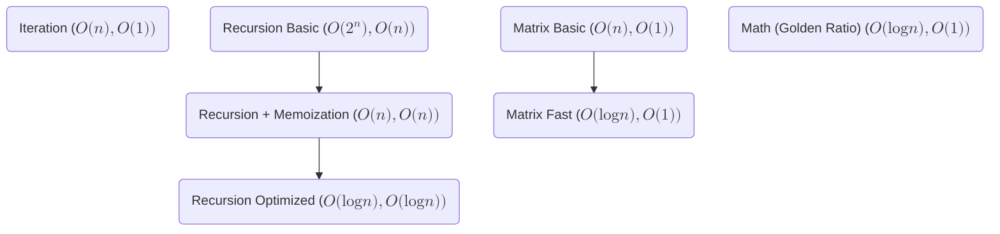
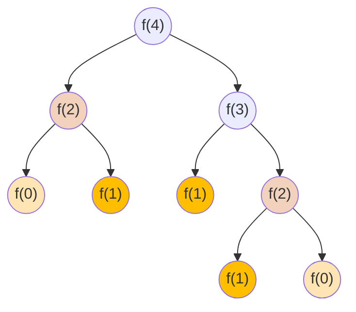

---
tags:
    - Math
    - Dynamic Programming
---

# 509. Fibonacci Number

## Problem Description

[LeetCode Problem 509](https://leetcode.com/problems/fibonacci-number/description/):
The **Fibonacci numbers**, commonly denoted `F(n)` form a sequence, called the
**Fibonacci sequence**, such that each number is the sum of the two preceding ones,
starting from `0` and `1`. That is,

```bash
F(0) = 0, F(1) = 1
F(n) = F(n - 1) + F(n - 2), for n > 1.
```

Given `n`, calculate `F(n)`.

## Clarification

- Input data type is int

## Assumption

- $n >= 0$

## Solution

Overview of different solutions:




### Approach 1: Recursion + Memoization

Since `F(n) = F(n - 1) + F(n - 2), for n > 1`, we can use recursion to compute the
Fibonacci number. Note that many intermediate calculations are repeated and we can use
memoization to restore these intermediate results and re-use them later.

For example, to compute `F(4)`, `F(4) = F(3) + F(2) = (F(2) + F(1)) + F(2)`, it computes
`F(2)` twice, `F(1)` 3 times, and `f(0)` twice.



=== "Python"
    ```python
    class Solution:
        def __init__(self):
            self.cache = {}

        def fib(self, n: int) -> int:
            # Base case
            if n < 2:
                return n
            elif n in self.cache:
                return self.cache[n]
            else:
                self.cache[n] = self.fib(n - 1) + self.fib(n - 2)
                return self.cache[n]
    ```

#### Complexity Analysis of Approach 1

- Time complexity: $O(n)$  
  Each number is visited once from 1 to $n$. Each visit is either computed or retrieved
  from cache for $n >= 2$.
- Space complexity: $O(n)$  
    - Recursion function call takes $n$ times, taking $O(n)$ space.
    - Cache stores $n - 2$ intermediate results, taking $O(n)$ space.

### Approach 2: Recursion Optimized

Prof. Edsger W. Dijkstra proposed an optimized recursive approach in
[note EWD654 "In honor of Fibonacci"](https://www.cs.utexas.edu/~EWD/ewd06xx/EWD654.PDF)
to computing Fibonacci numbers using fast doubling recursion.

Note that Dijkstra's series begins F(1)=0 and F(2)=1 so, using our index system which
has F(0)=0 and F(1)=1, we have:

$$\begin{eqnarray} F(2n - 1) = F(n - 1)^2 + F(n)^2 \\ F(2n) = (2 F(n - 1) + F(n)) F(n)  \end{eqnarray}$$

There are two different ways to implement this fast doubling recursion:

- Use cache to store intermediate results.
- Return tuple `(f_n, f_n1)` instead of cache since higher Fibonacci number calculation
just need two numbers.

=== "python"
    ```python
    class Solution:
        def __init__(self):
            self.cache = {}

        def fib(self, n: int) -> int:
            # Base case
            if n < 2:
                return n
            elif n in self.cache:
                return self.cache[n]
            else:
                if n % 2 == 0:
                    m = n // 2
                    self.cache[n] = (2 * self.fib(m - 1) + self.fib(m)) * self.fib(m)
                else:
                    m = (n + 1) // 2
                    self.cache[n] = self.fib(m - 1) * self.fib(m - 1) + self.fib(m) * self.fib(m)
                return self.cache[n]
    ```

=== "python - no cache"
    ```python
    class Solution:
        def fib(self, n: int) -> int:
            return fibonacci(n)[0]

    def fibonacci(n):
        if n == 0:
            return (0, 1)

        f_k, f_k1 = fibonacci(n // 2)

        f_2k = f_k * (2 * f_k1 - f_k)
        f_2k1 = f_k1 * f_k1 + f_k * f_k

        if n % 2 == 0:
            return (f_2k, f_2k1)
        else:
            return (f_2k1, f_2k + f_2k1)
    ```

#### Complexity Analysis of Approach 2

- Time complexity: $O(\log n)$  
  To compute $n$, it need to compute intermediate results by half each time, i.e.,
  $n \rightarrow n/2 \rightarrow n/4 \rightarrow \cdots 1$. So the time complexity is
  $O(\log n)$.
- Space complexity: $O(\log n)$  
    - The recursive function call takes $\log n$ times.
    - If using cache, the cache doesn't need to store all $n$ values and just need to store $2 \log n$
    values.
    - The overall time complexity is $O(\log n)$ with or without cache.

### Approach 3: Iteration

The problem can also be solve using iterative method by following Fibonacci number calculation.

=== "python"
    ```python
    class Solution:
        def fib(self, n: int) -> int:
            if n < 2:
                return n

            f_n_2 = 0
            f_n_1 = 1
            for i in range(2, n + 1):
                f_n = f_n_1 + f_n_2
                f_n_2, f_n_1 = f_n_1, f_n

            return f_n
    ```

#### Complexity Analysis of Approach 3

- Time complexity: $O(n)$  
  Compute all $n$ numbers iteratively.
- Space complexity: $O(1)$  
  Only use limited number of variables.

### Approach 4: Matrix Exponentiation

The Fibonacci sequence follows:

$$F_n = F_{n - 1} + F_{n - 2}$$

This can be rewritten in matrix form:

$$\begin{bmatrix} F_n \\ F_{n - 1} \end{bmatrix} = \begin{bmatrix} 1 & 1 \\ 1 & 0 \end{bmatrix} \begin{bmatrix} F_{n - 1} \\ F_{n - 2} \end{bmatrix}$$

Expanding this recurrence, we obtain

$$\begin{bmatrix} F_n \\ F_{n - 1} \end{bmatrix} = \begin{bmatrix} 1 & 1 \\ 1 & 0 \end{bmatrix}^{n - 1} \begin{bmatrix} F_1 \\ F_0 \end{bmatrix}$$

Since $F_1 = 1$ and $F_0 = 0$, we only need to extract the **top-left element** of the
matrix exponentiation result.

To compute Fibonacci efficiently, we perform [fast exponentiation by squaring](https://en.wikipedia.org/wiki/Exponentiation_by_squaring#Computational_complexity)
on the transformation matrix $\begin{bmatrix} 1 & 1 \\ 1 & 0 \end{bmatrix}$, which takes
$O(\log n)$ time.

=== "python"
    ```python
    class Solution:
        def fib(self, n: int) -> int:
            if n <= 1:
                return n

            M = [[1, 1], [1, 0]]
            result = matrix_exponentiation(M, n - 1)
            return result[0][0]


    def matrix_mult(A, B):
        """Multiply two 2x2 matrices."""
        return [
            [A[0][0] * B[0][0] + A[0][1] * B[1][0], A[0][0] * B[0][1] + A[0][1] * B[1][1]],
            [A[1][0] * B[0][0] + A[1][1] * B[1][0], A[1][0] * B[0][1] + A[1][1] * B[1][1]],
        ]


    def matrix_exponentiation(M, exp):
        """Computes M^exp using fast exponentiation."""

        # Only consider square matrix
        if not M or len(M) != len(M[0]):
            return []

        res = [[1, 0], [0, 1]]  # Identity matrix
        # Base case
        if exp == 0:
            return res
        if exp == 1:
            return M

        base = M

        while exp:
            if exp % 2 == 1:
                # If odd, multiply result by base
                # If exp starts with odd, it will execute twice, one at the beginning and the other at the end.
                # If exp starts with even, it will execute once at the end.
                res = matrix_mult(res, base)
            base = matrix_mult(base, base)  # square the base
            exp //= 2

        return res
    ```

=== "python - recursion"
    ```python
    class Solution:
        def fib(self, n: int) -> int:
            if n <= 1:
                return n

            M = [[1, 1], [1, 0]]
            result = matrix_exponentiation(M, n - 1)
            return result[0][0]


    def matrix_mult(A, B):
        """Multiply two 2x2 matrices."""
        return [
            [A[0][0] * B[0][0] + A[0][1] * B[1][0], A[0][0] * B[0][1] + A[0][1] * B[1][1]],
            [A[1][0] * B[0][0] + A[1][1] * B[1][0], A[1][0] * B[0][1] + A[1][1] * B[1][1]],
        ]


    def matrix_exponentiation(M, exp):
        """Computes M^exp using fast exponentiation."""

        # Only consider square matrix
        if not M or len(M) != len(M[0]):
            return []

        # Base case
        if exp == 0:
            return [[1, 0], [0, 1]]  # Identity matrix
        if exp == 1:
            return M

        half = matrix_exponentiation(M, exp // 2)
        half_square = matrix_mult(half, half)
        if exp % 2 == 0:
            return half_square
        else:
            return matrix_mult(half_square, M)
    ```

#### Complexity Analysis of Approach 4

- Time complexity: $O(\log n)$  
    - Matrix multiplication is $O(1)$ for fixed $2 \times 2$ matrix.
    - Matrix exponentiation uses exponentiation by squaring, which takes $O(\log n)$.
    - So the overall time complexity is $O(\log n)$.
- Space complexity: $O(1)$ for iteration or $O(\log n)$ for recursion  
    - For iteration, we only use several $2 \times 2$ matrices. So it's $O(1)$ space.
    - For recursion, the recursion call stack takes $O(\log n)$ space since the function
    recursively calls $\log n$ times.

### Approach 5: Math

The limit of ratio of consecutive Fibonacci numbers converges to the golden ration
$\varphi = \frac{1 + \sqrt{5}}{2}$:

$$\lim_{n \rightarrow \infty} \frac{F_{n+1}}{F_n} = \varphi$$

The Fibonacci sequence has a closed-form solution using the **Golden Ratio** $\varphi$.
The Fibonaaci number at index $n$ can be computed as:

$$F_n = \frac{\varphi^n - \psi^n}{\sqrt{5}}$$

where:

- $\varphi = \frac{1+\sqrt{5}}{2} \approx 1.6180339887$ (Golden ratio)
- $\psi = \frac{1 - \sqrt{5}}{2} \approx -0.6180339887$ (Conjugate of the Golden Ratio)
- $\sqrt{5}$ is a normalization factor

since $\psi^n = (-0.62)^n$ quickly approaches **zero** for large $n$, the formula
simplifies to:

$$F_n = \frac{\varphi^n}{\sqrt{5}}$$

Note that

- the eigenvalues of the Fibonacci transformation matrix are $\varphi$ and $\psi$.
- Python’s floating-point arithmetic is precise enough that rounding the result gives
the correct answer up to n ≈ 70.
- Beyond n ≈ 70, floating-point errors can accumulate, making this method **unreliable**
for **very large** Fibonacci numbers.

=== "python"
    ```python
    import math

    class Solution:
        def fib(self, n: int) -> int:
            phi = (1 + math.sqrt(5)) / 2
            return round(phi**n / math.sqrt(5))
    ```

#### Complexity Analysis of Approach 5

- Time complexity: $O(\log n)$  
  In Python, the `**` operator (or `pow(a, b)`) internally uses exponentiation by
  squaring, which takes $O(\log n)$ time.
- Space complexity: $O(1)$  
  Only a few variables used.

### Comparison of Different Approaches

The table below summarize the time complexity and space complexity of different
approaches:

Approach                             | Time Complexity | Space Complexity | Accuracy
-------------------------------------|-----------------|------------------|-----------------------------
Approach 1 - Recursion + Memoization | $O(n)$          | $O(n)$           | Accurate
Approach 2 - Recursion optimized     | $O(\log n)$     | $O(\log n)$      | Accurate
Approach 3 - Iteration               | $O(n)$          | $O(1)$           | Accurate
Approach 4 - Matrix                  | $O(\log n)$     | $O(1)$           | Accurate
Approach 5 - Math                    | $O(\log n)$     | $O(1)$           | Accurate up to $n \approx 70$

## Test
