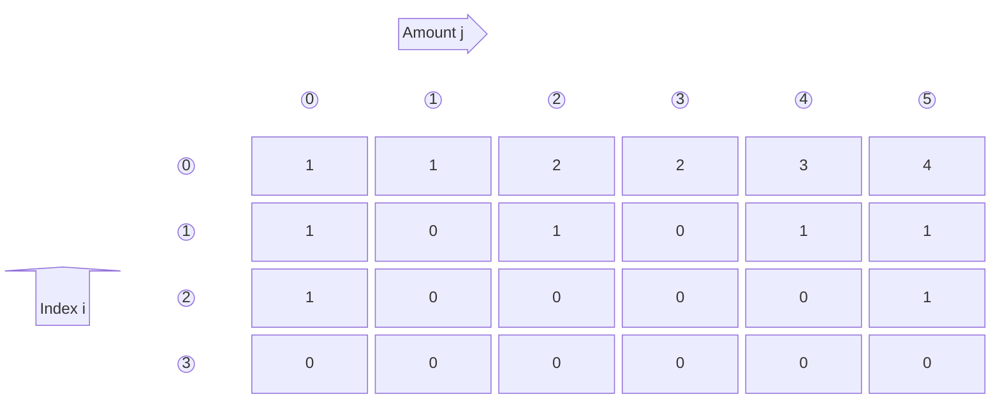
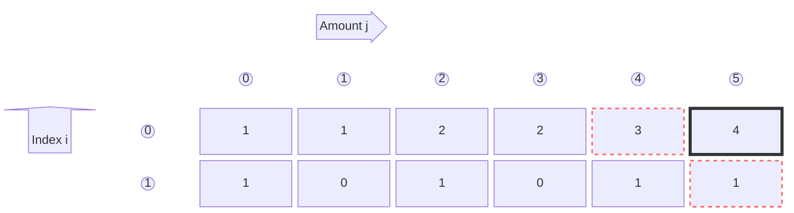

---
tags:
    - Dynamic Programming
---

# 518. Coin Change II

## Problem Description

[LeetCode Problem 518](https://leetcode.com/problems/coin-change-ii/description/):
You are given an integer array `coins` representing coins of different denominations and
an integer `amount` representing a total amount of money.

Return _the number of combinations that make up that amount_. If that amount of money
cannot be made up by any combination of the coins, return `0`.

You may assume that you have an infinite number of each kind of coin.

The answer is **guaranteed** to fit into a signed **32-bit** integer.

## Clarification

-

## Assumption

-

## Solution

There are two main ways to solve the program:

1. View problem as a **graph problem**. The node is the remaining amount and the edge is
coin value. We can use BFS to find all possible and unique path leads to 0 amount.
Note that the combinations `[1 2 2]`, `[2 1 2]`, and `[2, 2, 1]` are the same.
2. Use **dynamic programming**
    - **State**: `dp(i, amount)` represents the number of ways for the current coin i (index)
    with the remaining amount.
    - **State transition**:
        - `Coins[i] > amount` skip this coin since it is too large:
        `dp(i, amount) = dp(i + 1, amount)`
        - Combination of two cases:
            - Take this coin (can repeatedly use the same coin): `dp(i, amount - coins[i])`
            - Not take this coin: `dp(i + 1, amount)`
            - Sum of two cases: `dp(i, amount) = dp(i, amount - coins[i]) + dp(i + 1, amount)`
    - **Base case**:
        - `dp(i, 0) = 1`, since we can always make up 0 amount by not taking any coins
        That is one way.
        - `dp(n, amount) = 0` where n is the number of coins. No coin left to make up the amount.

### Approach 1: Top-Down Dynamic Programming

We can use top-down dynamic programming to solve the problem. We can use a recursive
function to find the number of ways to make up the amount using the coins up to the
current coin index `i` and the remaining amount `amount`.

=== "Python"
    ```python
    class Solution:
        def change(self, amount: int, coins: List[int]) -> int:
            self._cache = {}
            return self._count_combination(0, amount, coins)

        def _count_combination(self, i: int, amount: int, coins: List[int]) -> int:
            # Base case
            if amount == 0:  # not take coin for 0 (1 way)
                return 1
            if i == len(coins):  # no more coin left
                return 0

            if (i, amount) in self._cache:
                return self._cache[(i, amount)]

            if coins[i] > amount:
                num_ways = self._count_combination(i + 1, amount, coins)
            else:
                num_ways = self._count_combination(i, amount - coins[i], coins) + self._count_combination(i + 1, amount, coins)

            self._cache[(i, amount)] = num_ways
            return num_ways
    ```

#### Complexity Analysis of Approach 1

- Time complexity: $O(n \cdot m)$ where $n$ is number of coins and $m$ is the amount.
    - The total number of states are combination of coin index, `i`, and remaining amount, `amount`.
        - `i`: the current coin index --> range from `0` to `len(coins)` --> n states
        - `amount`: the remaining amount --> range from `0` to `amount` --> m states.
        Note that in the worst case, when coins contain 1, we will go through
        $0, 1, \cdots, \text{amount}$.
    - Calculation per state: due to memoization, each state is computed **only once** and each calculation takes $O(1)$.
    - Total time complexity is $O(n \cdot m)$.
- Space complexity: $O(n \cdot m)$  
    - Cache stores results for each `(i, amount)` --> $O(n \cdot m)$.
    - Recursion call goes as deep as $n + m$, moving `i` forward one at a time and reduce coin one by one.
    - The total time complexity is $O(n \cdot m) + O(n + m) = O(n \cdot m)$.

### Approach 2: Bottom-Up Dynamic Programming

We can also use a bottom-up approach to solve the problem by using a 2D list `dp[i][a]`
to store the number of ways to make `j` amount `a` using first `i` coins where `i` ranges
from 0 to `len(coins)` and `a` ranges from 0 to `amount`.

Here is the 2D array for the example `amount = 5, coins = [1,2,5]`:



=== "python"
    ```python
    class Solution:
        def change(self, amount: int, coins: List[int]) -> int:
            n = len(coins)
            dp = [[0] * (amount + 1) for _ in range(n + 1)]
            for i in range(n):
                dp[i][0] = 1

            for i in range(n - 1, -1, -1):
                for j in range(1, amount + 1):
                    if coins[i] > j:
                        dp[i][j] = dp[i + 1][j]
                    else:
                        dp[i][j] = dp[i + 1][j] + dp[i][j - coins[i]]

            return dp[0][amount]
    ```

#### Complexity Analysis of Approach 2

- Time complexity: $O(n \cdot m)$ where $n$ is number of coins and $m$ is the amount.
    - Initializing the `dp` array takes $O(n \cdot m)$.
    - Run two nested for-loops to fill the entire `dp` array. Each iteration takes
    $O(1)$ time. So it takes $O(n \cdot m)$ time to fill the `dp`.
    - The total time complexity is $O(n \cdot m) + O(n \cdot m) = O(n \cdot m)$.
- Space complexity: $O(n \cdot m)$  
    The `dp` array takes $O(n \cdot m)$ space.

### Approach 3: Bottom-Up Dynamic Programming with Space Optimization

From the state transition: `dp[i][j] = dp[i + 1][j] + dp[i][j - coins[i]]`, we just
need values from current row and previous row in 2D array and the value on the current
row won't be overwritten by future calculations. We can use 1D array to conduct the calculation:

- Before calculating `dp[j]`, `dp[j]` stores the previous calculated value
(i.e. `d[[i + 1][j]` in 2D array.
- `dp[j - coins[i]]` values are updated before `j` and can be used for calculating `dp[j]`.

In previous 2D example, `dp[0][5]` is calculated from `dp[0][4]` and `dp[1][5]`



=== "python"
    ```python
    class Solution:
        def change(self, amount: int, coins: List[int]) -> int:
            n = len(coins)
            dp = [0] * (amount + 1)
            dp[0] = 1

            for i in range(n - 1, -1, -1):
                for j in range(coins[i], amount + 1):
                    dp[j] += dp[j - coins[i]]

            return dp[amount]
    ```

#### Complexity Analysis of Approach 3

- Time complexity: $O(n \cdot m)$ where $n$ is number of coins and $m$ is the amount.
    - Initializing the `dp` array takes $O(n \cdot m)$.
    - Run two nested for-loops to fill the entire `dp` array. Each iteration takes
    $O(1)$ time. So it takes $O(n \cdot m)$ time to fill the `dp`.
    - The total time complexity is $O(n \cdot m) + O(n \cdot m) = O(n \cdot m)$.
- Space complexity: $O(m)$  
  The `dp` array takes $O(m)$ space.

### Approach 4: Breadth-First Search

We can view the problem as a graph problem. Each node is the remaining amount, and each
edge represents using a coin with coin value. We can use BFS to explore all possible
combinations of coins.

We want the number of combinations (**order doesn't matter**) of coins that sum to `amount`.
That means `{1, 2, 2}` is the same as `{2, 1, 2}` and `{2, 2, 1}`. So we need to enforce
a canonical order in our search.

If we represent a state as `(remaining, index)` where `remaining` is the remaining amount
and `index` is the coin index we are allowed to use from here forward. Then at each state `(remaining, index)`, we can either:

1. Use the coin at `index`, which reduces the `remaining` amount by `coins[index]` and keeps the `index` the same (since we can use the same coin again).
2. Skip the coin at `index`, which keeps the `remaining` amount the same and moves to the next coin by incrementing `index`.

Storing `(remaining, index)` ensures non-decreasing order of indices. Any valid combination
`{c1, c2, …, ck}` can be sorted in ascending order. That sorted sequence corresponds to
exactly one path through (remaining, index)

=== "python"
    ```python
    from collections import deque

    class Solution:
        def change(self, amount: int, coins: List[int]) -> int:
            n = len(coins)
            queue = deque([(amount, 0)])  # remaining amount, index
            num_ways = 0

            while queue:
                remaining, i = queue.popleft()

                if remaining == 0:
                    num_ways += 1
                    continue

                for j in range(i, n):
                    if coins[j] <= remaining:
                        queue.append((remaining - coins[j], j))

            return num_ways
    ```

#### Complexity Analysis of Approach 4

- Time complexity: $O(n \cdot m)$ where $n$ is number of coins and $m$ is the amount.
  Each state is visited at most once. There are $O(n \cdot m)$ possible states.
- Space complexity: $O(n \cdot m)$  
  Each state can be stored in the queue, and the maximum number of states is $O(n \cdot m)$.

  ### Approach 5: Backtracking

=== "python"
    ```python
    code
    ```

#### Complexity Analysis of Approach 5

- Time complexity: $O(1)$  
  Explanation
- Space complexity: $O(n)$  
  Explanation

### Comparison of Different Approaches

The table below summarize the time complexity and space complexity of different
approaches:

Approach   | Time Complexity | Space Complexity
-----------|-----------------|-----------------
Approach 1 - Top-Down DP | $O(n \cdot m)$          | $O(n \cdot m)$
Approach 2 - Bottom-Up DP | $O(n \cdot m)$          | $O(n \cdot m)$
Approach 3 - Bottom-Up DP Space Optimization | $O(n \cdot m)$  | $O(m)$

## Test
