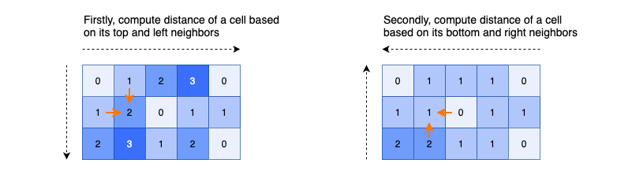

---
tags:
    - Breadth-First Search
    - Dynamic Programming
---

# LC542. 01 Matrix

## Problem Description

[LeetCode Problem 542](https://leetcode.com/problems/01-matrix/): Given an `m x n`
binary matrix `mat`, return _the distance of the nearest_ `0`_for each cell_.

The distance between two adjacent cells is `1`.

## Clarification

-

## Assumption

-

## Solution

### Approach - BFS

Use BFS to search starting from all `0`s. Note that starting from `1` leads to redundant
calculation and visiting.  Check `matrix` value to indicate whether it is visited
without using a dedicated set to track.

When updating distance, we can either update it based on the parent node since it is
visited or update based on the number of layers of BFS.

=== "Python"
    ```python
    class Solution:
    def updateMatrix(self, mat: List[List[int]]) -> List[List[int]]:
        m, n = len(mat), len(mat[0])
        dist_mat = [[-1 for_ in range(n)] for _ in range(m)]
        DIRECTIONS = [(-1, 0), (1, 0), (0, -1), (0, 1)]

        q = deque()
        for r in range(m):
            for c in range(n):
                if mat[r][c] == 0:
                    dist_mat[r][c] = 0
                    q.append((r, c))

        while q:
            r, c = q.popleft()
            for dx, dy in DIRECTIONS:
                nr, nc = r + dx, c + dy
                if 0 <= nr < m and 0 <= nc < n and dist_mat[nr][nc] == -1:
                    dist_mat[nr][nc] = dist_mat[r][c] + 1  #(1)
                    q.append((nr, nc))

        return dist_mat
    ```

    1. Update the distance based on the parent node which has been visited.

=== "Python 2"
    ```
    class Solution:
    def updateMatrix(self, mat: List[List[int]]) -> List[List[int]]:
        m, n = len(mat), len(mat[0])
        dist_mat = [[-1 for_ in range(n)] for _ in range(m)]
        DIRECTIONS = [(-1, 0), (1, 0), (0, -1), (0, 1)]

        q = deque()
        for r in range(m):
            for c in range(n):
                if mat[r][c] == 0:
                    dist_mat[r][c] = 0
                    q.append((r, c))

        dist = 1
        while q:
            size = len(q)
            for _ in range(size):
                r, c = q.popleft()
                for dx, dy in DIRECTIONS:
                    nr, nc = r + dx, c + dy
                    if 0 <= nr < m and 0 <= nc < n and dist_mat[nr][nc] == -1:
                        dist_mat[nr][nc] = dist
                        q.append((nr, nc))
            dist += 1

        return dist_mat
    ```

#### Complexity Analysis of Approach 1

- Time complexity: $O(m \times n)$  
  The BFS visits all nodes, $m \times n$, just once.
- Space complexity: $O(m \times n)$  
  In the worst case, the queue will add all nodes, $m \times n$.

### Approach 2 - DP

The problem can be solved using dynamic programming with some tweaks. For a cell with 4
neighbors, we  can't directly use dynamic programming to compute the distance of the
current cell based on 4 neighbors since distance of neighboring cells may not be
computed yet.

Instead, we use dynamic programming with two passes:

1. Start from top left corner, calculate minimum distance based on only two directions:
left and top neighbors, which has been visited
2. Start from bottom right corner, calculate the minimum distance based on the current
cell + only two directions: right and bottom, which has been visited

For example, assume only one `0` in the middle and the other is `1`.

- After the 1st pass, the top left half will be filled with `inf` and bottom right half
after `0` will have correct distance.
- After the 2nd pass, the top left half will the corrected

Refer to [explanations from @hiepit](https://leetcode.com/problems/01-matrix/solutions/1369741/c-java-python-bfs-dp-solutions-with-picture-clean-concise-o-1-space/)



=== "python"
    ```python
    class Solution:
    def updateMatrix(self, mat: List[List[int]]) -> List[List[int]]:
        dp = [row[:] for row in mat]
        m, n = len(mat), len(mat[0])

        for row in range(m):
            for col in range(n):
                if dp[row][col] != 0:
                    top = dp[row - 1][col] if row > 0 else math.inf
                    left = dp[row][col - 1] if col > 0 else math.inf
                    dp[row][col] = min(top, left) + 1

        for row in range(m - 1, -1, -1):
            for col in range(n - 1, -1, -1):
                if dp[row][col] != 0:
                    bottom = dp[row + 1][col] if row < m - 1 else math.inf
                    right = dp[row][col + 1] if col < n - 1 else math.inf
                    dp[row][col] = min(dp[row][col], bottom + 1, right + 1)  # (1)

        return dp
    ```

    1. Need to include the current cell since it is updated from the first pass

#### Complexity Analysis of Approach 2

- Time complexity: $O(m \times n)$  
  Iterate over matrix twice with constant work on each iteration. So the time complexity
  is $O(2 \times m \times n) = O(m \times n)$.
- Space complexity: $O(m \times n)$  
  The `dp` matrix contains $m \times n$ elements.

### Comparison of Different Approaches

The table below summarize the time complexity and space complexity of different approaches:

Approach    | Time Complexity   | Space Complexity |
------------| ---------------   | ---------------- |
Approach 1 -  BFS |  $O(m \times n)$           | $O(m \times n)$ |
Approach 2 -  DP |  $O(m \times n)$           | $O(m \times n)$  |

## Test
