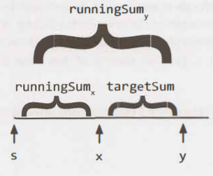

---
tags:
    - Array
    - Prefix Sum
    - Hash Table
---

# LC560. Subarray Sum Equals K
## Problem Description
[LeetCode Problem 560](https://leetcode.com/problems/subarray-sum-equals-k/): Given an array of integers `nums` and an integer `k`, return _the total number of continuous subarrays whose sum equals to `k`_.

## Clarification
- Subarray size could be 1 to len(nums)
- Array element could be negative

## Assumption
- Sum of subarray won't cause integer overflow

## Solution
### Approach - Brute Force

=== "Python"
    ```Python
    class Solution:
    def subarraySum(self, nums: List[int], k: int) -> int:
        n_sub_sum_k = 0
        for i in range(len(nums)):
            sum_sub = 0
            for j in range(i, len(nums)):
                sum_sub += nums[j]
                if sum_sub == k:
                    # Even find one, will continue since there may be more
                    n_sub_sum_k += 1

        return n_sub_sum_k
    ```

### Approach - Hashmap
The problem can be solved more efficiently in terms of cumulative sum. For the cumulative sum (running sum or prefix sum), we will have the following properties:

- $\text{runningSum}_x + \text{targetSum} = \text{runningSum}_y$, i.e., $\text{runningSum}_x = \text{runningSum}_y - \text{targetSum}$ for subarray sum equals k
	- $\text{runningSum}_y - \text{runningSum}_x$ is the sum of the subarray from index $x+1$ to $y$
- potentially multiple $runningSum_{x_1}, runningSum_{x_2}, \cdots, runningSum_{x_i}$ may satisfy the above equation since sum of subarray could be zero

The solution is to find any $\text{runningSum}_x$ for position y that satisfies the equation $\text{runningSum}_x = \text{runningSum}_y - \text{targetSum}$. We can use the hashmap to store the cumulative sum and associated number of occurrence to quickly find the number of subarrays whose sum satisfy the equation.  
  
The figure is from the book, "Cranking the coding interview" 

=== "Python"
    ```python
    class Solution:
    def subarraySum(self, nums: List[int], k: int) -> int:
        count = 0
        prefix_sum = 0
        sum_count_dict = {0:1} # (1)

        for num in nums:
            prefix_sum = prefix_sum + num

            if prefix_sum - k in sum_count_dict:
                count += sum_count_dict[prefix_sum - k]

            if prefix_sum not in sum_count_dict: # (2)
                sum_count_dict[prefix_sum] = 1
            else:
                sum_count_dict[prefix_sum] += 1

        return count
    ```

    1. Initialize with `{0:1}` for `prefix_sum == k` cases where `prefix_sum - k == 0`
    2. `if/else` statement can be simplified as one line `sum_count_dict[prefix_sum] = sum_count_dict.get(prefix_sum, 0) + 1`

=== "C++"
    ```cpp
    class Solution {
    public:
        int subarraySum(vector<int>& nums, int k) {
            unordered_map<long int, int> sum_map;
            long int sum = 0;
            int count = 0;

            for (int num : nums) {
                sum += num;

                if (sum == k) {
                    count++;
                }

                if (sum_map.find(sum - k) != sum_map.end()) {
                    count += sum_map[sum - k];
                }

                sum_map[sum]++;
            }
            return count;
        }
    };
    ```

#### Complexity Analysis
* Time complexity: $O(n)$  
	Traverse the array once.  
* Space complexity: $O(n)$  
	The hash map may contain up to $n$ distinct entries in the worst case.

### Comparison of Different Approaches
The table below summarize the time complexity and space complexity of different approaches:

Approach 	 | Time Complexity 	| Space Complexity  
------------ | --------------- 	| ----------------
Approach - Brute force |  $O(n^2)$ 	   	   	| $O(1)$  
Approach - Hashmap |  $O(n)$      		| $O(n)$

## Test
- `nums`: `[1]`, `k`: 0, it will test where to put map update `sum_map[sum]++`. It should be in the end of for-loop (not before the two if conditions). Otherwise, the count update will be wrong.
- `nums`: `[1, 2]`, `k`: 3, `prefix_sum == k`