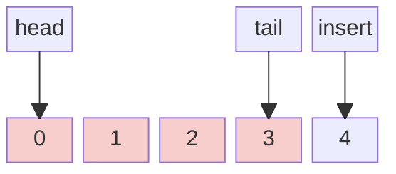
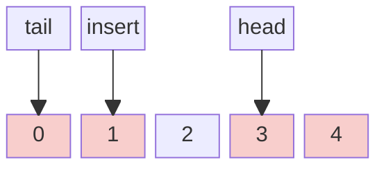

---
tags:
    - Queue
---

# LC622. Design Circular Queue

## Problem Description

[LeetCode Problem 622](https://leetcode.com/problems/design-circular-queue/): Design
your implementation of the circular queue. The circular queue is a linear data structure
in which the operations are performed based on FIFO (First In First Out) principle, and
the last position is connected back to the first position to make a circle. It is also
called "Ring Buffer".

Implement the `MyCircularQueue` class:

- `MyCircularQueue(k)` Initializes the object with the size of the queue to be `k`.
- `int Front()` Gets the front item from the queue. If the queue is empty, return `-1`.
- `int Rear()` Gets the last item from the queue. If the queue is empty, return `-1`.
- `boolean enQueue(int value)` Inserts an element into the circular queue. Return `true`
if the operation is successful.
- `boolean deQueue()` Deletes an element from the circular queue. Return `true` if the
operation is successful.
- `boolean isEmpty()` Checks whether the circular queue is empty or not.
- `boolean isFull()` Checks whether the circular queue is full or not.

You must solve the problem without using the built-in queue data structure in your
programming language.

## Clarification

- Implement circular queue without using built-in queue structure.
- What to return when deQueue an empty queue? Return false.
- When to return when enQueue a full queue? Return false.
- Which is front? The first enter element
- Which is tail? The last enter element

## Assumption

-

## Solution

### Approach - Array

We can use an array with a fixed size and two pointers (head and tail) to implement
circular queue. Note that if we know the head pointer, count of items, and array size,
we can use the following equations to get the tail pointer

```python
idx_tail = (idx_head + count - 1) % size
```

The insert index of the new item is the one after the tail pointer, we can use the
equation `idx_insert = (idx_head + count) % size`. Note that
we increase from `count - 1` to `count`.





=== "Python"
    ```python
    class MyCircularQueue:

        def __init__(self, k: int):
            self.array = [0] * k
            self.idx_head = 0
            self.count = 0
            self.size = k

        def enQueue(self, value: int) -> bool:
            if self.isFull():
                return False

            # (1)
            idx_insert= (self.idx_head + self.count)
            self.array[idx_insert] = value
            self.count += 1
            return True

        def deQueue(self) -> bool:
            if self.isEmpty():
                return False

            self.idx_head = (self.idx_head + 1) % self.size
            self.count -= 1
            return True

        def Front(self) -> int:
            if self.isEmpty():
                return -1

            return self.array[self.idx_head]

        def Rear(self) -> int:
            if self.isEmpty():
                return -1

            # (2)
            idx_tail = (self.idx_head + self.count - 1) % self.size
            return self.array[idx_tail]

        def isEmpty(self) -> bool:
            return self.count == 0

        def isFull(self) -> bool:
            return self.count == self.size
    ```

    1. Use the following equation to find the insert index: `idx_insert = (head + count) % size`. Examples:
    ```
    index:  0  1  2  3
    value: [1, 2, 3, _]
    idx_head = 0, count = 3, size = 4, idx_insert = (0 + 3) % 4 = 3
    index:  0  1  2  3
    value: [_, 2, 3, 4]
    idx_head = 1, count = 3, size = 4, idx_insert = (1 + 3) % 4 = 0
    ```
    2. Use the following equation to find the tail index, `idx_tail = (head + count - 1) % size`. Note that `count - 1` used here instead of `count`. Examples:
    ```
    index:  0  1  2  3
    value: [1, 2, 3, _]
    idx_head = 0, count = 3, size = 4, idx_insert = (0 + 3 - 1) % 4 = 2
    index:  0  1  2  3
    value: [_, 2, 3, 4]
    idx_head = 1, count = 3, size = 4, idx_insert = (1 + 3 - 1) % 4 = 3
    ```

#### Complexity Analysis of Approach 1

- Time complexity: $O(1)$  
    All methods use constant time complexity.
- Space complexity: $O(n)$  
    The array stores $n$ items.

## Test

- When the circular queue is empty (should return `-1` for `Front()` and `Rear()`).
- When the queue becomes full, additional enQueue operations should be rejected.
- Wrap-around behavior when `rear` reaches the end of the array.
