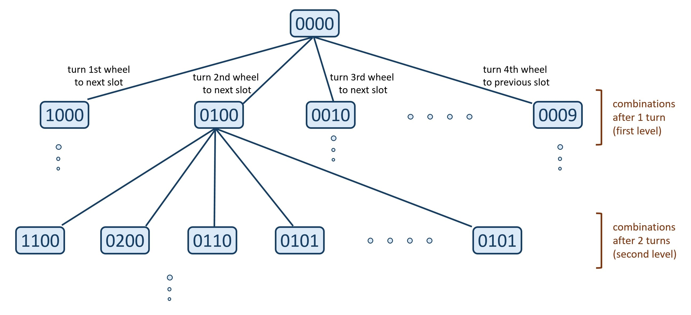

---
tags:
    - Breadth-First Search
---

# LC752. Open the Lock
## Problem Description
[LeetCode Problem 752](https://leetcode.com/problems/open-the-lock/): You have a lock in front of you with 4 circular wheels. Each wheel has 10 slots: `'0', '1', '2', '3', '4', '5', '6', '7', '8', '9'`. The wheels can rotate freely and wrap around: for example we can turn `'9'` to be `'0'`, or `'0'` to be `'9'`. Each move consists of turning one wheel one slot.

The lock initially starts at `'0000'`, a string representing the state of the 4 wheels.

You are given a list of `deadends` dead ends, meaning if the lock displays any of these codes, the wheels of the lock will stop turning and you will be unable to open it.

Given a `target` representing the value of the wheels that will unlock the lock, return the minimum total number of turns required to open the lock, or -1 if it is impossible.

## Clarification
- Each move just turning one wheel one slot
- Could be no turns due to deadends

## Assumption
- 

## Solution
### Approach - BFS
We can consider each combination is a node of a graph, and each wheel turn is an edge connecting two nodes. The given problem can be considered as how to find minimum steps from root node to target node in a graph.

We can use breadth-first search (BFS) method to traverse nodes level by level. Due to is level-order traversing, the first time is reaches the target, it is also the shorted path to the target.



=== "Python"
    ```python
    class Solution:
    SLOTS = ['0', '1', '2', '3', '4', '5', '6', '7', '8', '9']
    N_WHEELS = 4
    ROTATE_DIRECTIONS = [-1, 1]

    def neighbors(self, code: str) -> str:
        for i_wheel in range(self.N_WHEELS):
            letter = code[i_wheel]
            slot_index = self.SLOTS.index(letter)
            for j_rotate in self.ROTATE_DIRECTIONS:
                next_slot_index = (slot_index + j_rotate + len(self.SLOTS)) % len(self.SLOTS)
                yield code[:i_wheel] + self.SLOTS[next_slot_index] + code[i_wheel+1:]

    def openLock(self, deadends: List[str], target: str) -> int:
        if '0000' in deadends:
            return - 1
        
        n_turns = 0
        queue = deque()
        visited = set()
        queue.append('0000')
        visited.add('0000')

        while queue:
            current_level_node_count = len(queue)
            for _ in range(current_level_node_count):
                current_code = queue.popleft()
                if current_code == target:
                    return n_turns
                for neighbor_code in self.neighbors(current_code):
                    if neighbor_code not in deadends and neighbor_code not in visited:
                        queue.append(neighbor_code)
                        visited.add(neighbor_code)
            n_turns += 1

        return -1
    ```

#### Complexity Analysis
* Time complexity: $O(n^w w)$  
	In the worst case, we might iterate all $n^w$ unique combinations, where $n = 10$ is the number of slots for each wheel and $w = 4$ is the number of wheels of the lock. For each combination, perform $2w$ turns, rotating left or right (twice) for each wheel. So time complexity is $O(n^w 2 w)$ = $O(n^w w)$ 
* Space complexity: $O(n^w)$  
	In the worse case, push all $n^w$ unique combinations of length $w$ string in the queue and the hash set. So the space complexity is $O(2n^w w)$ = $O(n^w w)$

## Test