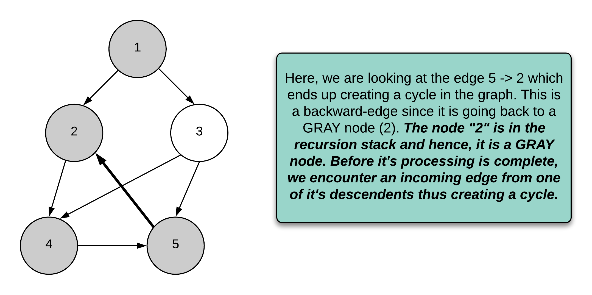
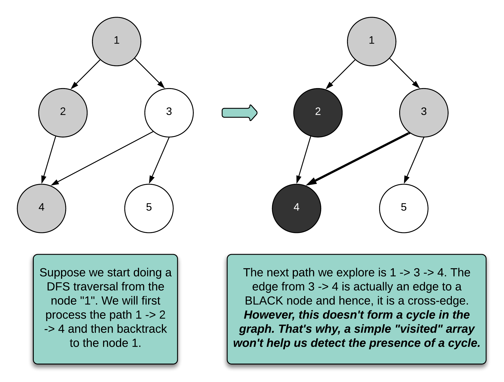

---
tags:
    - Depth-First Search
---

# LC1059. All Paths from Source Lead to Destination

## Problem Description

[LeetCode Problem 1059](https://leetcode.com/problems/all-paths-from-source-lead-to-destination/): Given the edges of a directed graph where edges[i] = [ai, bi] indicates there is an edge between nodes ai and bi, and two nodes source and destination of this graph, determine whether or not all paths starting from source eventually, end at destination, that is:

At least one path exists from the source node to the destination node
If a path exists from the source node to a node with no outgoing edges, then that node is equal to destination.
The number of possible paths from source to destination is a finite number.
Return true if and only if all roads from source lead to destination.

## Clarification

- Is there a cycle in the path?
- Graph may not be connected.

## Assumption


## Solution

### Approach - DFS

We can use depth-first search method to traverse the graph and check two conditions:

1. When reaching leaf node (no neighbors), check whether it is the destination.
2. Check any cycle is detected, using node-coloring variant of DFS as explained in the [Introduction to Algorithms] book (https://en.wikipedia.org/wiki/Introduction_to_Algorithms).

???+ note Node-Coloring Variant of DFS

    When traversing using DFS, assign one of the  below 3 colors to every vortex:  
    - **White**, vertex is not processed yet. Initially, all vertices are white.  
    - **Grey**, vertex is in processing. DFS for this vertex has started but not finished (i.e, some descendants of this vortex are not process yet)  
    - **Black**, vertex and all its descendants are processed.

**How is the cycle detected?**  
Refer to LeetCode editorial explanations.


**Why a simply visited does not work?**  
Refer to LeetCode editorial explanations.


=== "Python"
    ```python
    class Solution:
        def __init__(self):
            # No need to define white, using None instead
            self.GREY = 1
            self.BLACK = 2

        def leadsToDestination(self, n: int, edges: List[List[int]], source: int, destination: int) -> bool:
            vertices = [[] for _ in range(n)]
            colors = [None] * n  # None: not. visited, 1: in processed, 2: done

            for edge in edges:
                vertices[edge[0]].append(edge[1])

            return self.dfs(vertices, source, destination, colors)

        def dfs(self, vertices: List[List[int]], curr_node: int, destination: int, colors: List[int]) -> bool:
            # Detect a cycle
            # If curr_node is white (not visited) or black (done), won't create a cycle
            # If curr_node is grey (in process), but receive a incoming link from last step, it is a loop
            if colors[curr_node] != None:
                return colors[curr_node] == self.BLACK

            # No outgoing links, reach the end
            if len(vertices[curr_node]) == 0:
                return curr_node == destination

            # Mark as grey (in process)
            colors[curr_node] = self.GREY

            for next_node in vertices[curr_node]:
                # Short circuit and return false if detected a "False" from any recursive call
                if not self.dfs(vertices, next_node, destination, colors):
                    return False

            # Recursive processing is done, mark the node as black
            colors[curr_node] = self.BLACK
            return True
    ```

#### Complexity Analysis of Approach 1

- Time complexity: $O(V + E)$  
    - Reconstructing vertices from edges takes $O(V)$
    - Use DFS with color ensures each vertex visited with limited time and takes $O(V)$.
- Space complexity: $O(V + E)$  
    - The vortex list store all vertices and their associated neighbors, taking $O(V + E)$.
    - The color takes $O(V)$ space.

### Approach2 - Topological Sorting

[Topological Sorting](https://en.wikipedia.org/wiki/Topological_sorting)

=== "python"
    ```python
    code
    ```

#### Complexity Analysis of Approach 2

- Time complexity: $O(1)$  
  Explanation
- Space complexity: $O(n)$  
  Explanation

### Comparison of Different Approaches

The table below summarize the time complexity and space complexity of different approaches:

Approach    | Time Complexity   | Space Complexity |
------------| ---------------   | ---------------- |
Approach -  |  $O(1)$           | $O(n)$ |
Approach -  |  $O(1)$           | $O(n)$  |

## Test
