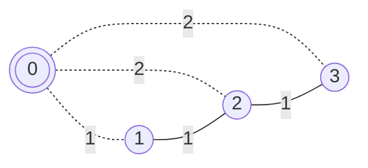

---
tags:
    - Union Find
    - Minimum Spanning Tree
---

# LC1168. Optimize Water Distribution in a Village

## Problem Description

[LeetCode Problem 1168](https://leetcode.com/problems/optimize-water-distribution-in-a-village/description/):
There are `n` houses in a village. We want to supply water for all the houses by
building wells and laying pipes.

For each house `i`, we can either build a well inside it directly with cost
`wells[i - 1]` (note the `-1` due to **0-indexing**), or pipe in water from another well
to it. The costs to lay pipes between houses are given by the array `pipes` where each
`pipes[j] = [house1j, house2j, costj]` represents the cost to connect `house1j` and
`house2j` together using a pipe. Connections are bidirectional, and there could be
multiple valid connections between the same two houses with different costs.

Return _the minimum total cost to supply water to all houses_.

## Clarification

- Supply water for all the houses --> fully connected
- Either build a well or connect it with pipes
- Connections are bidirectional
- House index starts from 1

## Assumption

-

## Solution

The problem can be viewed as a **weighted undirected graph**. Each house represents a
vertex and each pipe with cost represents the edge between two houses with weight.

The challenging part is how to handle multiple wells with costs associated with houses.
The solution is to add **one virtual vertex** to represent the well and add edges
between the well and houses. The weight of the edge is the cost of building a well at
the corresponding house.

For the input `Input: n = 3, wells = [1,2,2], pipes = [[1,2,1],[2,3,1]]`, we can create
the following graph with the virtual vertex `0` represents the well.



The problem of finding the minimal total cost to supply water to all houses is
transformed into find a subset of edges that connect all vertices with minimum total
weight, i.e., finding a minimum spanning tree.

### Approach 1 - Kruskal's Algorithm with Union Find

To solve the minimum spanning tree problem, we can use classical
[Kruskal's algorithm](../../algorithms/graph/minimum-spanning-tree/kruskal-algorithm.md)
with union-find structure. The algorithm can be implemented with the following two steps:

1. First, **sort** all the edges based on their costs, including the additional edges
added between the virtual vertex (a well) and houses.
2. Then **iterate** through the sorted edges. If both vertices belong to different
groups using Union Find data structure, add the edge to the minimum spanning tree list
and increase the total cost.

=== "Python"
    ```python
    from operator import itemgetter

    class UnionFind:
        def __init__(self, size: int) -> None:
            self.root = [i for i in range(size)]
            self.rank = [0] * size

        def find(self, x: int) -> int:
            if x != self.root[x]:
                self.root[x] = self.find(self.root[x])
            return self.root[x]

        def union(self, x: int, y: int) -> bool:  # (1)
            root_x = self.find(x)
            root_y = self.find(y)

            if root_x != root_y:
                if self.rank[root_x] > self.rank[root_y]:
                    self.root[root_y] = root_x
                elif self.rank[root_x] < self.rank[root_y]:
                    self.root[root_x] = root_y
                else:
                    self.root[root_y] = root_x
                    self.rank[root_x] += 1

        def connected(self, x: int, y: int) -> bool:
            return self.find(x) == self.find(y)

    class Solution:
        def minCostToSupplyWater(self, n: int, wells: List[int], pipes: List[List[int]]) -> int:
            ordered_edges = []

            for index, cost in enumerate(wells):  # (2)
                ordered_edges.append((0, index + 1, cost))

            ordered_edges.extend(pipes) # (3)

            ordered_edges.sort(key=itemgetter(2))  # (4)

            # (5)
            uf = UnionFind(n + 1)  # (6)
            total_cost = 0
            n_edges_mst = 0
            for house_1, house_2, cost in ordered_edges:
                if not uf.connected(house_1, house_2):
                    uf.union(house_1, house_2):
                    total_cost += cost
                    n_edges_mst += 1

                if n_edges_mst >= n:
                    break

            return total_cost
    ```

    1. Return a flag to indicate whether the joining actually happens within the
    function. Otherwise, need to add an additional function to check `find(a) == find(b)`.
    2. Add edges between a well (the virtual vertex with index of 0) and houses. The
    weight of the edge is the cost of building the well.
    3. Add the edges from pipes.
    4. Sort all edges by their weights.
    5. Iterate through the ordered edges and find minimum spanning tree.
    6. `+1` for the well (a virtual node).

#### Complexity Analysis of Approach 1

- Time complexity: $O((V + E) \log (V + E))$ where $V$ is the number of houses
(vertices) and $E$ is the number of pipes (edges)  
    - Adding edges between a well and houses takes $O(V)$ iterations;
    - Adding edges from pipes takes $O(E)$ iterations;
    - Sorting $V + E$ edges takes $O((V + E) \log (V + E))$;
    - Create union find structure takes $O(V)$ time;
    - Go through all edges take $O(V + E)$ iterations and each iteration takes
    $O(\alpha(V)$ time. So the overall iteration time is $O((V + E) \alpha(V))$;  
    So the total time complexity is
    $O(V) + O(E) + O((V + E) \log (V + E)) + O(V) + O((V + E) \alpha(V))$, which can be
    simplified as $O((V + E) (\log (V + E) + \alpha(V))) = O((V + E) \log (V + E))$.
- Space complexity: $O(V + E)$  
    - The order edges list stores $V + E$ edges, taking $O(V + E)$ space;
    - The union-find data structure takes $O(V)$ space to store `root` and `rank`;
    - The sorting algorithm in Python ([Timsort](https://en.wikipedia.org/wiki/Timsort))
    takes $O(V + E)$;  
    So the overall space complexity is $O(V + E) + O(V) + O(V + E) = O(V + E)$.

### Approach 2 - Prim's Algorithm

We can also use Prim's algorithm to find the minimum spanning tree.

=== "python"
    ```python
    import heapq
    from collections import defaultdict

    class Solution:
        def minCostToSupplyWater(self, n: int, wells: List[int], pipes: List[List[int]]) -> int:
            edges = defaultdict(list)
            for i in range(1, n + 1):
                edges[0].append((wells[i - 1], i))
                edges[i].append((wells[i - 1], 0))
            for house1, house2, cost in pipes:
                edges[house1].append((cost, house2))
                edges[house2].append((cost, house1))

            pq = [(0, 0)]  # (cost, index)
            nodes_in_mst = set()
            total_cost = 0
            while pq:
                curr_cost, curr_id = heapq.heappop(pq)
                if curr_id in nodes_in_mst:
                    continue

                total_cost += curr_cost
                nodes_in_mst.add(curr_id)

                if len(nodes_in_mst) == n + 1:
                    break

                for next_cost, next_id in edges[curr_id]:
                    if next_id not in nodes_in_mst:
                        heapq.heappush(pq, (next_cost, next_id))

            return total_cost
    ```

#### Complexity Analysis of Approach 2

- Time complexity: $O((V + E) \log (V + E))$ where $V$ is the number of nodes and $E$ is
the number of pipes.  
    - Adding edges between a well and houses takes $O(V)$ time;
    - Adding edges from pipes takes $O(E)$ time;
    - In the worst case, the algorithm goes through all edges, $O(V + E)$,including new
    edges to the virtual node. Each iteration, pop node from heap or push node to queue
    takes $O(\log (V + E))$. So the time is $O((V + E) \log (V + E))$.  
    So the total time complexity is $O(V) + O(E) + O((V + E) \log (V + E))$ =
    $O((V + E) \log (V + E))$.
- Space complexity: $O(V + E)$  
    - Edges take $O(V + E)$ space for both vertices and edges;
    - The set takes $O(V)$ space in the worst case;
    - In the worst case, the heap stores all combined edges, $V + E$.  
    So the overall space complexity is $O(V + E) + O(V) + O(V + E) = O(V + E)$.

### Comparison of Different Approaches

The table below summarize the time complexity and space complexity of different
approaches:

Approach    | Time Complexity   | Space Complexity |
------------| ---------------   | ---------------- |
Approach 1 - Kruskal's Algorithm  |  $O((V + E) \log (V + E))$  | $O(V + E)$ |
Approach 2 - Prim's Algorithm  |  $O((V + E) \log (V + E))$     | $O(V + E)$  |

## Test
