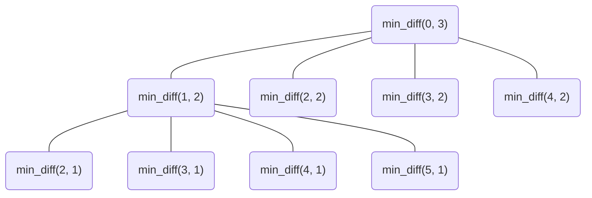

---
tags:
    - Dynamic Programming
---

# 1335. Minimum Difficulty Of A Job Schedule

## Problem Description

[LeetCode Problem 1335](https://leetcode.com/problems/minimum-difficulty-of-a-job-schedule/):
You want to schedule a list of jobs in `d` days. Jobs are dependent (i.e To work on the
`ith` job, you have to finish all the jobs `j` where `0 <= j < i`).

You have to finish **at least** one task every day. The difficulty of a job schedule is
the sum of difficulties of each day of the `d` days. The difficulty of a day is the
maximum difficulty of a job done on that day.

You are given an integer array `jobDifficulty` and an integer `d`. The difficulty of
the `ith` job is `jobDifficulty[i]`.

Return _the minimum difficulty of a job schedule_. If you cannot find a schedule for
the jobs return `-1`.

## Clarification

-

## Assumption

-

## Solution

The problem can be solved using dynamic programming by defining:

- **State**: `min_diff(i, d)` represents the minimum difficulty of scheduling when
starting at the `i`th job with `d` days left.
- **State transition**: For starting job `i`, we can choose to end the current day at
job `j` (where `j` is between `i + 1` and the last possible job for the current day,
`n - d + 1`), and the difficulty for that day would be the maximum job difficulty from
job `i` to job `j`. So the state transition can be expressed as:

$$\text{min_diff}(i, d) = \min_{j=i+1}^{n-d+1} \left( \text{min_diff}(j+1, d-1) + \max(\text{jobDifficulty}[i:j]) \right)$$

- **Base case**: When there is only one day left (`d == 1`), the difficulty is simply the
maximum job difficulty from job `i` to the end of the list: $\text{min_diff}(i, 1) = \max(\text{jobDifficulty}[i:])$

- **Edge case**: If there are fewer jobs than days, return `-1` since it's impossible to
schedule.



### Approach 1: Top-Down Dynamic Programming

Based on the state and state transition defined above, we can implement a top-down dynamic
programming solution using memoization to avoid redundant calculations.

=== "Python"
    ```python
    class Solution:
      def minDifficulty(self, jobDifficulty: List[int], d: int) -> int:
          n = len(jobDifficulty)

          # Edge case: make sure there is at least one job per day
          if n < d:
              return -1

          self.memo = {}

          return self._min_diff(jobDifficulty, 0, d)

      def _min_diff(self, jobDifficulty: List[int], i: int, days_remaining: int) -> int:
          # Return cached results if exist
          if (i, days_remaining) in self.memo:
              return self.memo[(i, days_remaining)]

          # Base case: finish all remaining jobs in the last day
          if days_remaining == 1:
              self.memo[(i, days_remaining)] = max(jobDifficulty[i:])
              return self.memo[(i, days_remaining)]

          n = len(jobDifficulty)
          min_total = float('inf')
          daily_max_job_diff = 0  # the maximum difficulty of today

          # Iterate through possible starting index for the next day
          # and ensure there is at least one job for each remaining day.
          for j in range(i, n - days_remaining + 1):
              daily_max_job_diff = max(daily_max_job_diff, jobDifficulty[j])
              total = daily_max_job_diff + self._min_diff(jobDifficulty, j + 1, days_remaining - 1)
              min_total = min(min_total, total)

          self.memo[(i, days_remaining)] = int(min_total)
          return int(min_total)
    ```

=== "Python - LRU Cache"
    ```python
    from functools import lru_cache

    class Solution:
        def minDifficulty(self, jobDifficulty: List[int], d: int) -> int:
            n = len(jobDifficulty)

            # Edge case: make sure there is at least one job per day
            if n < d:
                return -1

            return self._min_diff(tuple(jobDifficulty), 0, d)  # (1)

        @lru_cache(None)
        def _min_diff(self, jobDifficulty: tuple, i: int, days_remaining: int) -> int:
            # Base case: finish all remaining jobs in the last day
            if days_remaining == 1:
                return max(jobDifficulty[i:])

            n = len(jobDifficulty)
            min_total = float('inf')
            daily_max_job_diff = 0  # the maximum difficulty of today

            # Iterate through possible starting index for the next day
            # and ensure there is at least one job for each remaining day.
            for j in range(i, n - days_remaining + 1):
                daily_max_job_diff = max(daily_max_job_diff, jobDifficulty[j])
                total = daily_max_job_diff + self._min_diff(jobDifficulty, j + 1, days_remaining - 1)
                min_total = min(min_total, total)

            return int(min_total)
    ```

    1. `jobDifficulty` is passed as a `tuple` into `_min_diff()` so it's hashable and usable with `@lru_cache`

#### Complexity Analysis of Approach 1

- Time complexity: $O(n^2 \cdot d)$ where $n$ is the number of jobs and $d$ is the number of days.
    - Number of unique states: $O(n \cdot d)$. For state $(i, d)$,
        - $i$: job index, from $0$ to $n-1$, which is $O(n)$
        - $d$: remaining days, from $1$ to $d$, which is $O(d)$
    - Each state takes $O(n)$ time to compute the minimum difficulty for the remaining jobs
    - Total time complexity: $O(n \cdot d) \cdot O(n) = O(n^2 \cdot d)$
- Space complexity: $O(n \cdot d)$  
    - The memoization dictionary stores results for each unique state $(i, d)$, which
    has $O(n \cdot d)$ entries. So as the LRU cache.
    - The recursion call stack can go up to $O(d)$ deep.
    - So the total space complexity is $O(n \cdot d) + O(d) = O(n \cdot d)$.

???- "Refined analysis of unique states"
    The valid unique states $(i, d)$ are those where $n - i \geq d \rightarrow i \leq n - d$. So we can sum over valid $i$ values for each $d$:

    $$\sum_{k=1}^d (n - k + 1) = d \cdot n - \frac{d(d-1)}{2}$$

    This is $O(n \cdot d - d^2)$ with the upper bound of $O(n \cdot d)$.

### Approach 2: Bottom-Up 1D Dynamic Programming

We can also implement a bottom-up dynamic programming solution by iteratively filling
a DP table based on the state transition defined above. Since the state only depends on
the previous day's results, we can optimize the space complexity to $O(n)$ by using a
single array to store the minimum difficulty for the next day.

=== "python"
    ```python
    class Solution:
      def minDifficulty(self, jobDifficulty: List[int], d: int) -> int:
          n = len(jobDifficulty)
          min_diff_prev_day = [float('inf')] * n + [0]
          for days_remaining in range(1, d + 1):
              min_diff_curr_day = [float('inf')] * n + [0]
              for i in range(n - days_remaining + 1):
                  daily_max_job_diff = 0
                  for j in range(i + 1, n - days_remaining + 2):
                      daily_max_job_diff = max(daily_max_job_diff, jobDifficulty[j - 1])
                      min_diff_curr_day[i] = min(min_diff_curr_day[i], daily_max_job_diff + min_diff_prev_day[j])
              min_diff_prev_day = min_diff_curr_day

          return min_diff_prev_day[0] if min_diff_prev_day[0] < float('inf') else -1
    ```

#### Complexity Analysis of Approach 2

- Time complexity: $O(n^2 \cdot d)$  
    - Similar to Approach 1, we have $O(n \cdot d)$ unique states.
    - Each state takes $O(n)$ time to compute the minimum difficulty for the remaining jobs.
    - Total time complexity: $O(n \cdot d) \cdot O(n) = O(n^2 \cdot d)$
- Space complexity: $O(n)$  
    - We only use two arrays of size $n$ to store the minimum difficulty for the current
    and previous days, so the space complexity is $O(n)$.

### Comparison of Different Approaches

The table below summarize the time complexity and space complexity of different
approaches:

Approach   | Time Complexity | Space Complexity
-----------|-----------------|-----------------
Approach - Top-Down | $O(n^2 \cdot d)$ | $O(n \cdot d)$
Approach - Bottom-Up | $O(n^2 \cdot d)$ | $O(n)$

## Test

- Test $n$ < $d$ (impossible to schedule)
- Test $n$ = $d$ (each job on a separate day)
- Test $n$ > $d$ (multiple jobs on some days)
