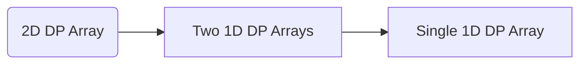

---
tags:
    - Dynamic Programming
---

# 1770. Maximum Score From Performing Multiplication Operations

## Problem Description

[LeetCode Problem 1770](https://leetcode.com/problems/maximum-score-from-performing-multiplication-operations/description/):
You are given two **0-indexed** integer arrays `nums` and `multipliers` of size `n` and
`m` respectively, where `n >= m`.

You begin with a score of `0`. You want to perform **exactly** `m` operations. On the
`ith` operation (**0-indexed**) you will:

- Choose one integer `x` from **either the start or the end** of the array `nums`.
- Add `multipliers[i] * x` to your score.
    - Note that `multipliers[0]` corresponds to the first operation, `multipliers[1]` to
    the second operation, and so on.
- Remove `x` from `nums`.

Return _the **maximum** score after performing_ `m` _operations._

## Clarification

-

## Assumption

-

## Solution

### Approach 1: Dynamic Programming (Top-Down with Memoization)

The problem can be solved using dynamic programming.

- **State**: `dp(op, left, right)`, the maximum score after performing `op` operations with
  `left` and `right` as the left and right indices of the remaining numbers in `nums`.
- **Recurrence relation**: for each state, we have two options:
    - **Select left**:, the score is
    `dp(op + 1, left + 1, right) + nums[left] * multipliers[op]`
    - **Select right**: the score is
    `dp(op + 1, left, right - 1) + nums[right] * multipliers[op]`  
    Select maximum of results obtained by selecting from left and right: `max(dp(op + 1, left + 1, right) + nums[left] * multipliers[op], dp(op + 1, left, right - 1) + nums[right] * multipliers[op])`
- **Base case**: If `op` is equal to `m`, return `0` since we have performed all operations.

**Note** that the state can be reduced to `dp(op, left)` since `right` can be inferred as
`len(nums) - 1 - (op - left)`. If we have completed `op` operations and the left pointer
is at `left`, it means there are `op - left` operations from the right side, and thus
the right pointer can be calculated as `len(nums) - 1 - (op - left)`.

=== "Python"
    ```python
    class Solution:
        def maximumScore(self, nums: List[int], multipliers: List[int]) -> int:
            self.memo = {}
            return self.dp(nums, multipliers, 0, 0, len(nums) - 1)

        def dp(self, nums: List[int], multipliers: List[int], op: int, left: int, right: int) -> int:
            # Base case:
            if op == len(multipliers) or left > right:
                return 0

            # Return previously computed result
            if (op, left, right) in self.memo:
                return self.memo[(op, left, right)]

            # Recursively computed scores by selecting left and right
            left_score = self.dp(nums, multipliers, op + 1, left + 1, right) + nums[left] * multipliers[op]
            right_score = self.dp(nums, multipliers, op + 1, left, right - 1) + nums[right] * multipliers[op]
            max_score = max(left_score, right_score)
            self.memo[(op, left, right)] = max_score

            return max_score
    ```

#### Complexity Analysis of Approach 1

- Time complexity: $O(m^2)$  
    - Each call is uniquely determined by `(op, left)` (right can be inferred from `op`
  and `left`) where:
        - $0 \leq \text{op} \leq \text{m}$
        - $0 \leq \text{left} \leq \text{op}$ (because we can't select more than `op`
    numbers from the left)  
    So the total number of unique states is $\sum_{i=0}^m i = \fract{m^2}{2}$.
    - Each state takes $O(1)$ time to compute (just max of two recursive calls + multiplication).
    - So the total time complexity is $O(m^2)$.
- Space complexity: $O(m^2)$  
    - The memoization dictionary stores up to $O(m^2)$ results.
    - The recursion call stack can go up to $O(m)$ deep, calling all operations.
    - So the total space complexity is $O(m^2) + O(m) = O(m^2)$.

### Approach 2: Dynamic Programming (Bottom-Up)

The problem can also be solved using dynamic programming in a bottom-up manner. We can
use a 2D array `dp` where `dp[op][left]` represents the maximum score after performing
`op` operations with the left pointer at `left`. The right pointer can be inferred as
`right = len(nums) - 1 - (op - left)`.
We can fill the `dp` array in reverse order, starting from the last operation and
working our way to the first operation.

=== "python"
    ```python
    class Solution:
        def maximumScore(self, nums: List[int], multipliers: List[int]) -> int:
            n_ops = len(multipliers)
            n_num = len(nums)

            dp = [[0] * (n_ops + 1) for _ in range(n_ops + 1)]

            for op in range(n_ops - 1, -1, -1):
                for left in range(op, -1, -1):
                    right = n_num - 1 - (op - left)
                    dp[op][left] = max(
                        multipliers[op] * nums[left] + dp[op + 1][left + 1],
                        multipliers[op] * nums[right] + dp[op + 1][left],
                    )

            return dp[0][0]
    ```

With **space optimization**, we can reduce the space complexity by changing the 2D DP
array to 2 1D DP array to only 1 1D DP array.



The space complexity can be reduced to $O(m)$ by using a single array `dp` of size
`n_ops + 1` to store the maximum scores for each operation. The `dp` array is updated in
reverse order to ensure that the values from the previous operation are used correctly
in the current operation.

=== "python"
    ```python
    class Solution:
        def maximumScore(self, nums: List[int], multipliers: List[int]) -> int:
            n_ops = len(multipliers)
            n_num = len(nums)

            dp = [0] * (n_ops + 1)

            for op in range(n_ops - 1, -1, -1):
                for left in range(0, op + 1, 1):
                    right = n_num - 1 - (op - left)
                    dp[left] = max(
                        multipliers[op] * nums[left] + dp[left + 1],
                        multipliers[op] * nums[right] + dp[left],
                    )

            return dp[0]
    ```

#### Complexity Analysis of Approach 2

- Time complexity: $O(m^2)$  
    - The outer loop iterates `m` times (for each operation).
    - The inner loop iterates up to `m` times (for each possible left index).
    - Each iteration takes $O(1)$ time to compute the maximum score.
    - So the total time complexity is $O(m^2)$.
- Space complexity: $O(m)$  
  The optimized `dp` array is of size `m + 1`, so the space complexity is $O(m)$.

### Approach 3: Tree Traversal

The problem can be viewed as a binary tree where each node represents a state of the
problem. The root node represents the initial state with zero score, and each level of
the tree represents a multiplication operation. The left child of a node represents
choosing the first number in `nums`, while the right child represents choosing the last
number in `nums`. The leaf nodes represent the final scores after all operations have
been performed.

So we can traverse the tree and find the maximum score.

**Optimization**: consider as a graph, starting from the root node (with all `nums`)
and branching to left node (choosing the first number in `nums`) and right node
(choosing the last number in `nums`). The edge connects nodes from (i-1)th level to the
ith level is the multiplication. Then it becomes finding the path with the maximum score.

=== "python"
    ```python
    from collections import deque

    class Solution:
        def maximumScore(self, nums: List[int], multipliers: List[int]) -> int:
            return self.bfs(nums, multipliers)

        def bfs(self, nums: list[int], multipliers: list[int]) -> int:
            n_operations = len(multipliers)
            max_score = 0
            level = 0
            queue = deque([(0, 0, len(nums) - 1)])  # (score, begin index, end index), indices are for subsets of nums

            while queue:
                size = len(queue)

                for _ in range(size):
                    score, idx_begin, idx_end = queue.popleft()

                    # Check whether finish all operations
                    if level == n_operations:
                        max_score = max(max_score, score)
                        continue

                    queue.append((score + nums[idx_begin] * multipliers[level], idx_begin + 1, idx_end))  # Choose from the start
                    queue.append((score + nums[idx_end] * multipliers[level], idx_begin, idx_end - 1))  # Choose from the end

                level += 1

            return max_score
    ```

#### Complexity Analysis of Approach 3

- Time complexity: $O(2^m)$  
  Explore all possible combinations of `nums` and `multipliers` in a tree-like structure.
    - Each node in the tree represents a state of the problem, and the number of nodes
    is $O(2^m)$ where $m$ is the number of operations.
    - The maximum depth of the tree is $O(m)$, where $m$ is the number of operations.
    - Each node takes $O(1)$ time to process.
    - The total time complexity is $O(2^m)$.
- Space complexity: $O(2^m)$  
  The queue stores the states of the nodes at each level of the tree. The maximum number
  of nodes happening at the last level (`m`th level) is $O(2^m)$.

### Comparison of Different Approaches

The table below summarize the time complexity and space complexity of different
approaches:

Approach   | Time Complexity | Space Complexity
-----------|-----------------|-----------------
Approach 1 - Dynamic Programming (Top-Down) | $O(m^2)$          | $O(m^2)$
Approach 2 - Dynamic Programming (Bottom-Up) | $O(m^2)$          | $O(m)$
Approach 3 - Tree Traversal | $O(2^m)$          | $O(2^m)$

## Test

- Test normal cases
- Test edge cases like empty `nums` or `multipliers`
- Test cases where `n` is equal to `m`
